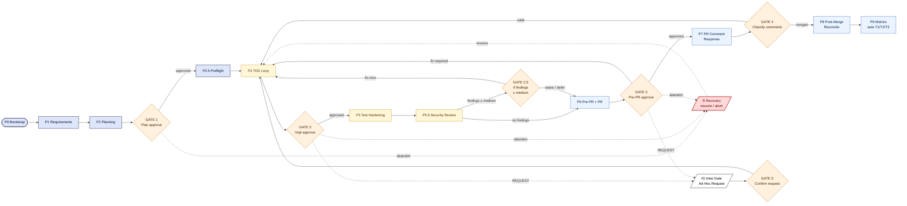

# ai-sdlc-harness · v2.1

**An AI-driven SDLC harness for Claude Code.** Drives a real engineering workflow — requirements → plan → tests → code → review → security → PR → reconcile — across one or many repos. Multi-agent, language-agnostic, discovery-driven. No application code lives here, only the agents, skills, hooks, and conventions that run them.

| Workflow | Purpose | Entry point |
|---|---|---|
| **Story Workflow** | Refine and groom stories before development | `/story-workflow <command> <work-item-id>` |
| **Dev Workflow** | Take a story from requirements to merged PR end-to-end | `/dev-workflow <work-item-id>` |

> The authoritative workflow specification — phases, ownership, status transitions, non-negotiable rules — lives in [CLAUDE.md](CLAUDE.md). This README is the guided tour. New to the harness? Start with [getting-started.md](getting-started.md) for the 10-minute install-to-first-story path.

## What's new in v2.1

| Area | Change |
|---|---|
| **Quick Mode** | New `/dev-workflow quick <id>` fast-path for trivial changes (typo fixes, one-character edits, lock-file bumps). Developer + Reviewer only — Planner and Tester are skipped per CC-05.8. Eligibility is heuristic-driven via `scripts/quick-mode-classify.py`; the tracker carries an explicit `Mode: quick` header and `Quick-Mode: true` flag so P9 metrics can segment quick-vs-full runs. `QPhaseGuard` enforces the invariants (no Planner invocation, no Tester invocation, single commit). |
| **Aggregate workflow report** | New `/dev-workflow report` utility command. Reads `ai/_metrics-log.csv` and produces a multi-story rollup with `--since`, `--format md\|json`, `--story` filters. Markdown output is a Mermaid-charted scorecard; JSON is plain rows for downstream tooling. |
| **Manifest schema for commands** | Every dev-workflow command file now ships with a sibling `<command>.manifest.yaml` declaring its prerequisites, produced artifacts, exit criteria, and gate emissions. A new manifest-schema doc + cc-check enforces parity. Consumers (the orchestrator, `workflow-status`, future automation) read manifests instead of grepping command prose. |
| **Markdown size budgets** | New `cc-check-md-budget` Convention-Check enforces per-file size caps from `agents/shared/markdown-budgets.md` (e.g. command files ≤ 400 lines, context files ≤ 200). Started in WARN mode, flipped to BLOCK in this release. `scripts/markdown-size-report.py` is the human-facing version (sorted budget-status table). Top-4 command files were surgically reduced to fit (`orchestrator-rules.md` 420 → 164; `plan-generator/SKILL.md` 830 → 337). |
| **Cost + token observability** | New Stop hook `metrics-token-collector.py` aggregates per-turn token counts into the tracker so P9 metrics can report agent-token totals per phase. `_metrics-log.csv` schema bumped to v1.1.0 with a non-destructive migration. New `cost-config.md` template carries per-model rate cards; `init-workspace` Step 6d lays it down at workspace bootstrap. |
| **Tracker + status schema v1.1** | The two cross-cutting schemas under `agents/shared/` accumulated the v2.1 amendment batch — `Mode:` header, `Workflow-Dir:` field, `Test hardening completed`/`Security review completed` stamps, ad-hoc batch counters, the `Quick-Mode:` flag. The Quick-Mode metric stamp + token-total field are reader-required (P9), writer-required (per-phase emitters). |
| **TDD-skip planner heuristics** | The Planner's `agents/planner/index.md` carries a new section on when to recommend Quick Mode versus the full workflow at intake. Heuristics live in `scripts/quick-mode-classify.py` so they're testable and tunable in one place. |
| **Doc surgery (CC-04.8)** | Five context/command files restructured to fit the 200/400-line caps without losing content — shared snippets moved into siblings, cross-refs replace duplication. `orchestrator-rules.md`, `plan-generator/SKILL.md`, `develop.md`, `plan.md`, `requirements.md`, `create-pr.md` all in scope. |
| **Subagent_type mapping table** | `orchestrator-rules.md` now spells out the fully-qualified `subagent_type` for each `@ai-sdlc-X` mention (the four agent roles plus the reviewer's four modes), so the `Agent` tool can be invoked without the orchestrator pattern-matching plugin prefix + role from the mention text. CC-04. |

## What's new in v2.0

| Area | Change |
|---|---|
| **Per-workflow artifacts** | Everything for one story now lives under `ai/<YYYY-MM-DD>-<work-item-id>/` — plan, tracker, coverage, security, metrics, PR-comment-analysis, pre-PR report. Replaces the split `ai/plans/` + `ai/tasks/` layout. |
| **Ad-hoc requests are first-class** | Mid-workflow change requests at GATE 2, GATE 3, or via `/dev-workflow request <id> "<text>"` are triaged by the Reviewer against the approved plan, classified (IN_SCOPE_BUG / IN_SCOPE_AC_MISS / OUT_OF_SCOPE / PLAN_CONFLICT / DUPLICATE / INVALID), gated by **GATE 5**, and land in a dedicated `## Ad-hoc Tasks (Batch <N>)` section. Re-enters Phase 3 with re-hardening on the affected repo's `T-TEST` lane. Out-of-scope items surface back to the human with explicit expand-scope / defer / withdraw options — never silently merged. |
| **Pre-flight runs after GATE 1** | Feature branches are created only in the repos the plan named (via the tracker's `## Repo Status` section), eliminating the pre-v2 orphan branches in unaffected repos. The plan commit moves into pre-flight so it lands on the just-created feature branch in single-repo workspace-is-git-repo runs. |
| **`Initial development completed` metric rename** | The Workflow Metric formerly known as `Development completed` is now `Initial development completed` — it records the **first** Phase 3 close. Phase 7 re-entries are tracked separately by `PR review response completed`; ad-hoc batches by `Ad-hoc requests completed`. `Development started` keeps its original name. |
| **P5.5 Static Security Review** | New phase between Test Hardening and PR Creation. Runs SAST + secret-scan + CVE per repo via the `security-report` skill. Gate 2.5 fires only when findings &ge; medium, offering WAIVE / DEFER / FIX-NOW. |
| **P8 Post-Merge Reconciliation** | New phase that auto-fires on PR merge. Transitions the work item, cleans up worktrees, stamps `Workflow completed`, archives the tracker in-place to `tracker.archived.md`. |
| **P9 Metrics & Observability** | New auto-phase. T1 fires at PR creation, T2 each PR-response round, T3 at post-merge. Emits per-workflow `metrics-report.md` plus appends a row to workspace-level `ai/_metrics-log.csv`. |
| **R Workflow State Recovery** | Cross-cutting recovery path is now first-class. Stop-failure marker + PostCompact rehydrate from the tracker; human picks resume vs abort. |
| **Hotfix re-entry** | `/dev-workflow hotfix` with two modes: `un-archive` clones `tracker.archived.md` into a fresh `tracker.md` within the 30-day window; `linked-fresh` spawns a new workflow dir with bidirectional `Hotfix-Of:` / `Hotfixed-By:` headers. |
| **TDD red-verify** | New PreToolUse hook proves test cases actually failed before the developer is allowed to write production code. Replays the test command, caches green/red attestations per task. |
| **naming-config runtime read** | Branch, commit, and path patterns live in `.claude/context/naming-config.md` and are consumed at runtime by the commit-msg validator. Override patterns without code changes. |
| **Convention-Check tier** | New `cc-check.py` aggregator runs 14 strict-by-default convention checks (header hygiene, shared-ref drift, artifact paths, naming, mermaid syntax, tunable thresholds, provider parity, drift-sweep residuals). Wired into `tests/run.sh`. |
| **Per-task worktree** | Worktrees now use the `<repo>-t<n>-<uid8>` pattern with an orchestrator-side UID8 suffix, preventing the cross-task path collisions that the previous flat layout could hit. |
| **Gate stall stamping** | Every human gate now stamps `Gate prompted <ts>` so a `workflow-status` run can surface stalled gates instead of looking idle. |

## Install

Requires **Claude Code** ([claude.ai/code](https://claude.ai/code)).

```
/plugin marketplace add MostAshraf/ai-sdlc-harness
/plugin install ai-sdlc-harness@ai-sdlc-harness
/reload-plugins
/init-workspace
```

That's it. `/dev-workflow` and `/story-workflow` are now available.

> **Scope options:** Add `--scope project` to share the plugin with your team via `.claude/settings.json`, or `--scope local` to keep it personal and git-ignored. Default is `--scope user` (personal, applies everywhere).

> **Runtime support:** Claude Code today. Codex CLI, Cursor, GitHub Copilot, and OpenCode are on the roadmap (separate work).

## Migrating from v1.x

If you've been running any v1.y.z release of the harness, your workspace has the old split layout:

```
ai/
├── plans/<work-item-id>.md
└── tasks/<work-item-id>.md
```

v2.0 writes every workflow artifact for one story to a single per-workflow directory keyed by date + work-item ID:

```
ai/<YYYY-MM-DD>-<work-item-id>/
├── plan.md
├── tracker.md
├── coverage-report-<repo>.md
├── static-security-report-<repo>.md
├── pre-pr-report.md
├── pr-comment-analysis-report-<n>.md
└── metrics-report.md
```

The two layouts cannot coexist — v2.0's `SKILL.md` gate refuses to run any phase command against a workspace where `ai/plans/` or `ai/tasks/` still contain `.md` files. You'll see:

```
❌ v1.x layout detected — run /dev-workflow migrate before proceeding.
```

Run the migration:

```
/dev-workflow migrate
```

The migrate command handles **three classes of change** in a single pass:

**Workflow artifacts** — moves your existing stories:

1. **Scans** `ai/plans/` and `ai/tasks/` for every legacy `.md` story file.
2. **Pairs** plans with their matching trackers by filename stem (the work-item ID).
3. **Derives a date** per story from `Plan approved:` in the tracker, or falls back to the plan's mtime.
4. **Presents a per-story table** of source files → target directory, and asks for explicit `y` confirmation. Default is NO.
5. **Moves** each pair atomically into `ai/<YYYY-MM-DD>-<work-item-id>/` (CC-05.7.1 normalises slashes / colons / spaces in the ID).
6. **Stamps** a migration footer in the moved tracker so the audit trail survives.
7. **Removes** `ai/plans/` and `ai/tasks/` once they're empty (`rmdir` — defensive against accidental data loss).

**Plugin shared files** — mirrors the same job as `/init-workspace --refresh-shared`:

8. Runs `scripts/refresh-shared.sh` to copy the plugin's `agents/shared/*.md` files into `.claude/context/agents-shared/`. v2.0 subagents reference these via workspace-relative paths; v1.x workspaces don't have the mirror because the agent-runtime path fix landed post-1.7.2.

**New + updated context files** — provisions v2.0 workspace state:

9. Creates `.claude/context/naming-config.md` if absent, with defaults that **match the v1.x literal patterns** (branch `${team}/feature/${story_id}-${slug}`, commit `#${story_id} #${task_id}: ${slug}`, etc.) — your existing branches and commits stay valid.
10. Creates `.claude/context/state.md` if absent, stamping `Bootstrap completed:` with the migration timestamp (your v1.x workspace IS bootstrapped — just without the v2.0 sentinel).
11. Backfills `> Owner:` / `> Version:` headers (CC-04.4/.6) into the five v1.x context files (`provider-config.md`, `repos-metadata.md`, `repos-paths.md`, `language-config.md`, `conventions.md`) where missing. No other in-place mutation — your existing settings (repo paths, conventions, language toolchains, provider config) are preserved verbatim.

The migration is **idempotent and non-destructive**: it never modifies branches, worktrees, or commits — only files under `ai/` and `.claude/context/`. Re-running on a v2.0 workspace short-circuits with `Workspace already on v2.0 layout — nothing to migrate.` (or proceeds to S7+S8+S9 only if the layout is already migrated but the new context files are still missing).

For the full step-by-step + failure-mode table see [skills/dev-workflow/commands/migrate.md](skills/dev-workflow/commands/migrate.md).

## Prerequisites

| Dependency | Why |
|---|---|
| **Claude Code** | The CLI that runs this harness. Install from [claude.ai/code](https://claude.ai/code). |
| **Git** | Branch management, worktree isolation, commits. |
| **Python 3** | **Required.** Every guard hook parses its JSON payload in Python; the commit-msg validator uses `shlex` for `git` argument parsing. If `python3` / `python` is not on `PATH`, the shared hook library exits at source time and the underlying tool call is blocked. Pre-installed on macOS and modern Linux; Windows users should install from [python.org](https://www.python.org/downloads/) before `/init-workspace`. |
| **Provider MCP / CLI** *(optional)* | One of: ADO, Jira, GitLab, GitHub, or Zoho MCP. The `gh-cli` and `glab-cli` git providers don't need an MCP server. The `local-markdown` provider needs nothing at all. Selected during `/init-workspace`. |

Target repos must be **cloned locally** — this harness does not clone them. Each repo should be on its default branch and current before running `/init-workspace`. No language prerequisites — toolchains are discovered.

---

## Workflow at a Glance



Five **human gates** (Plan approve, Impl approve, Pre-PR approve, PR comment classification, Ad-hoc request confirmation). One **conditional gate** (Security review — only if findings &ge; medium). Everything else runs hands-off between gates.

## Detailed Sequence

```mermaid
sequenceDiagram
    autonumber
    participant H as Human
    participant O as Orchestrator
    participant P as Planner
    participant D as Developer
    participant R as Reviewer
    participant T as Tester
    participant K as Skill

    Note over O: P0 Bootstrap runs once via /init-workspace — skipped in this view
    Note over O: Every workflow artifact lives under ai/{date}-{work-item-id}/ per CC-05.7
    Note over O: Single-repo view — multi-repo stories run lanes in parallel per repo

    rect rgb(40, 75, 110)
        Note over H,P: P1 — Requirements Ingestion
        O->>P: Pull story, analyse requirements
        P-->>O: AGENT STATUS — summary + clarifying questions
        O->>H: Surface questions
        H-->>O: Answers
        O->>P: Resolve ambiguities
        P-->>O: AGENT STATUS — requirements confirmed
    end

    rect rgb(35, 90, 75)
        Note over H,P: P2 — Planning and Approval
        O->>P: Decompose into plan + Test Outline + tracker
        P-->>O: AGENT STATUS — plan + tracker written to workflow dir
        O->>H: Present plan + Test Outline (GATE 1)
        H-->>O: APPROVED
        Note over O: Stamp 'Plan approved'
    end

    rect rgb(60, 60, 70)
        Note over O: P2.5 — Preflight (orchestrator only)
        Note over O: Create feature branch + commit the plan
    end

    rect rgb(60, 95, 50)
        Note over H,R: P3 — TDD Development Loop (per task)
        loop For each task T(n)
            Note over O: Tracker T(n) → In Progress
            alt test-required true (default)
                O->>T: Write failing tests for T(n)
                T-->>O: AGENT STATUS — red tests committed
                O->>D: Make tests green
            else test-required false
                O->>D: Implement T(n) directly
            end
            D-->>O: AGENT STATUS — worktree commit + build pass
            Note over O: Tracker T(n) → In Review
            O->>R: Review combined diff
            R-->>O: AGENT STATUS — verdict + [R/T/S] comments
            alt APPROVED
                Note over O: git merge --squash → Tracker Done
            else CHANGES_REQUESTED
                O->>D: Relay [R] comments, same worktree
                Note over O: Loop back to review
            end
        end
    end

    rect rgb(75, 50, 100)
        Note over H,O: P4 — Implementation Approval (GATE 2)
        Note over O: Stamp 'Initial development completed'
        O->>H: Present implementation summary
        H-->>O: APPROVED
        Note over O: Stamp 'Human approval (impl)'
    end

    rect rgb(40, 90, 85)
        Note over H,T: P5 — Test Hardening
        O->>T: Fill coverage gaps to 90 percent or higher
        T-->>O: AGENT STATUS — tests committed + coverage report
        O->>R: Review new tests (read-only)
        R-->>O: AGENT STATUS — verdict
        Note over O: Stamp 'Test hardening completed'
    end

    rect rgb(115, 80, 25)
        Note over H,K: P5.5 — Static Security Review (auto)
        O->>K: security-report skill (SAST + secrets + CVE)
        K-->>O: static-security-report per repo
        alt no medium-or-higher findings
            Note over O: Auto-proceed — stamp 'Security review passed'
        else medium-or-higher findings
            O->>H: GATE 2.5 — WAIVE / DEFER / FIX-NOW
            H-->>O: Decision
            alt FIX-NOW
                Note over O: Re-enter P3 with fix tasks
            else WAIVE / DEFER
                Note over O: Stamp decision, proceed to P6
            end
        end
    end

    rect rgb(30, 90, 120)
        Note over H,R: P6 — Pre-PR Review + PR Creation
        Note over O: git rebase --autosquash — squash fixups into task commits
        O->>R: Pre-PR holistic review (full branch vs default)
        R-->>O: pre-pr-report.md — AC coverage, conventions, security, hygiene
        O->>H: Present report (GATE 3)
        H-->>O: APPROVED
        Note over O: Commit tracker, run pr-creator
        O->>K: Create PR via provider adapter
        K-->>O: PR URL stamped on tracker
        Note over O: P9 trigger T1 — metrics emitted (round 0)
    end

    rect rgb(90, 55, 95)
        Note over H,P: P7 — PR Comment Response (on-demand)
        Note over O: Triggered by /dev-workflow review-response {id}
        O->>R: pr-comment-analysis — challenge each comment vs plan + AC
        R-->>O: Findings — VALID / INVALID / PARTIAL
        O->>H: Present findings (GATE 4)
        H-->>O: Pick which to address
        alt at least one VALID accepted
            O->>P: Append amendments to tracker
            Note over O: Re-enter P3 for amendment tasks only
            Note over O: P9 trigger T2 — metrics for this round
        else all rejected
            Note over O: Reply on PR with rationale
        end
    end

    rect rgb(80, 55, 40)
        Note over H,O: P8 — Post-Merge Reconciliation (auto on PR merge)
        Note over O: Detect PR merged → transition work item → clean worktrees
        Note over O: Rename tracker.md → tracker.archived.md (in place)
        Note over O: Stamp 'PR merged' + 'Workflow completed'
        Note over O: P9 trigger T3 — final metrics emitted
    end

    Note over O: IG — Inter-Gate Ad-Hoc Requests: reply REQUEST at GATE 2/3 or run /dev-workflow request mid-phase → Reviewer triages → GATE 5 confirms → ad-hoc batch enters P3
    Note over O: R — Recovery — stop-failure marker plus PostCompact hook rehydrate state from tracker, human picks resume vs abort
```



---

## The Agents

| Agent | Role | Key restriction |
|---|---|---|
| **Planner** | Pulls the story, asks clarifying questions, proposes approaches, writes plan + Test Outline + tracker. | Writes restricted to the workflow dir (`ai/<date>-<id>/`). |
| **Developer** | Implements production code in per-task git worktrees, runs builds. | No work-item provider access; never touches the tracker. |
| **Reviewer** | Reviews code for spec compliance and quality; runs build/test independently. Modes: `review` / `pre-pr` / `pr-comment-analysis` / `request-triage`. | Strictly read-only — never writes any file. |
| **Tester** | Writes failing tests in Phase 3 (`auto-tdd`); fills coverage gaps in Phase 5 (`auto-harden`). | No work-item provider access. |

The **Orchestrator** (the main Claude Code conversation) coordinates all agents, owns the task tracker, manages phase transitions, stamps metrics, and is the only writer of provider state.

## Story Workflow

Refines, analyzes, and grooms stories **before** development. Output is always posted as a work-item comment.

| Command | When to use | What it produces |
|---|---|---|
| `improve` | Default — handles most stories | Complete refined story (adaptive: fast for good stories, conversational for rough ones) |
| `analyze` | Pre-refinement assessment to share with the team | Readiness report with red/yellow/green flags |
| `refine` | Complex stories needing section-by-section approval | Refined story (slow, interactive) |
| `groom` | Post-refinement — technical deep-dive before sprint planning | Per-repo technical notes with affected files, risks, testing strategy |

`improve` is the recommended default. It internally assesses readiness and adapts: skips questions for good stories, asks targeted questions for partial ones, runs up to two rounds for rough stories.

```
Raw story → /story-workflow improve → /story-workflow groom → /dev-workflow
```

## Key Concepts

### Per-workflow artifact paths (v2.0)

Every artifact for one story lives under a single directory keyed by date + work-item ID:

```
ai/2026-05-18-PROJ-123/
├── plan.md                                    # Phase 2 output
├── tracker.md                                 # rolling state (→ tracker.archived.md after P8)
├── coverage-report-<repo>.md                  # Phase 5 per repo
├── static-security-report-<repo>.md           # Phase 5.5 per repo
├── pre-pr-report.md                           # Phase 6
├── pr-comment-analysis-report-<n>.md          # Phase 7 per round
└── metrics-report.md                          # Phase 9
```

The work-item ID is normalised (CC-05.7.1) — slashes, colons, spaces become `-`. Collision detection runs at P1 entry so two devs can't accidentally share the same directory. The strict CC0507 Convention-Check fails the build if any consumer regresses to the old `ai/plans/` or `ai/tasks/` paths.

### Task Tracker

A Markdown file (`tracker.md`) that tracks every task's status through the workflow. The tracker stays **uncommitted during development** (only the orchestrator updates it in the working tree) and is committed once in Phase 6 before PR creation. Keeps the git history clean — only code commits during development.

```
⏳ Pending → 🔧 In Progress → 🔄 In Review → ✅ Done → 📦 Archived (after P8)
                                     ↓
                              🔧 In Progress (on changes requested)
```

Dev tasks (`T1`, `T2`, ...) track Phase 3. One `T-TEST-<RepoName>` row per affected repo tracks Phase 5 hardening through the same lifecycle. Task Metrics additionally capture `Test Written` (when the tester commits failing tests) and `Green At` (when the developer commits the passing implementation).

Cross-task dependencies are declared in the Notes column with a canonical `depends: T<n>[, T<n>...]` token; the orchestrator gates each lane on every listed Task ID being ✅ Done. The plan-generator also renders a Mermaid `flowchart LR` of the full task graph in a `## Dependency Graph` section of the tracker.

A tracker can accumulate up to four additional sections — `## Pending Requests`, `## Amendments (PR Review Round <N>)`, `## Ad-hoc Tasks (Batch <N>)`, `## Deferred Requests`. The full schema lives in [skills/plan-generator/tracker-schema.md](skills/plan-generator/tracker-schema.md) (single source of truth).

### Worktree isolation

The Developer works in a temporary git worktree at `<repo>-t<n>-<uid8>` — a separate checkout of the repo with an orchestrator-side UID8 suffix to prevent cross-task path collisions. This means:

- Development happens in isolation from the feature branch
- On review approval, all commits are squash-merged into one clean commit
- On changes requested, the Developer fixes in the same worktree (commits with `fixup!` markers that the Phase 6 autosquash collapses)
- If worktree creation fails (e.g. Windows lock issue), the orchestrator falls back to working directly on the feature branch — `worktree_failed: true` is set on the task, and the `squash-merge-verify` hook still enforces commit isolation regardless of which path produced them

### TDD red-verify

A PreToolUse hook (`tdd-red-verify`) refuses to let the developer write production code for a task until the tester has committed at least one test that the hook has independently observed failing. Replay caches live in `.claude/state/tdd-attestations/<task-id>.json`; cached green attestations are honoured for the same SHA. No tests, no implementation.

### Build & test verification

Quality is enforced through independent verification at each stage:

- **API-compatibility precondition** — The Developer consults the named library's docs for the exact version stamped by the Planner (`[API: <lib> v<version>]`) before writing code. Not the latest stable, not from memory.
- **Developer build** — The Developer runs the repo's build command (from `language-config.md`) and passes its strictness policy before committing. On failure: 2 retry attempts, then escalate.
- **Reviewer build + test** — The Reviewer must independently run the build (and test for test reviews). Never trusts another agent's claim.
- **Tester coverage** — The Tester runs the test command and achieves ≥ 90% line coverage on new/modified code only. Do NOT go out of scope. On failure: 2 retry attempts, then escalate.

### Structured Reviews

The Reviewer performs a three-phase review:

0. **Ownership & convention pre-check** — Runs first. Verifies no forbidden path writes (developer/tester must not touch the workflow dir), commit-message format, no emoji shortcodes in Markdown, no sensitive files (`.env`, `.pem`, `.key`). Any failure immediately returns `🔄 Changes Requested` and skips the later phases.
1. **Spec compliance** — Does the code match the plan? Failures produce `[S1]`, `[S2]`, ... comments. If spec fails, code quality is skipped entirely.
2. **Code quality** — Are conventions followed? Are there bugs? Produces `[R1]`, `[R2]`, ... on production code and `[T1]`, `[T2]`, ... on test code, with severities `CRITICAL` / `WARNING` / `SUGGESTION`. The orchestrator routes `R` → Developer, `T` → Tester, `S` → by file path; when both impl and test comments exist on the same task, the Tester runs first.

**Phase 6 pre-PR holistic review** produces a structured `pre-pr-report.md` on disk plus a console rendering for GATE 3: full change surface (every file changed with category), AC-by-AC verification with implementation and test evidence, task coverage, test quality, conventions, SOLID/DRY/YAGNI, security, git hygiene, risk & assumptions review vs plan, open items (TODO/FIXME/HACK + unanswered story questions), and a ready-to-use PR description draft. For multi-repo stories, each repo's reviewer emits a **Contract Verification table** with observed signatures; the orchestrator does a lexical cross-repo compare and surfaces any drift before PR creation.

### Multi-repo stories

When a story spans multiple repos, developer lanes run **in parallel** across repos while tasks remain **sequential within each repo**. Cross-repo dependencies (API contracts, message schemas, shared DTOs) are defined by the Planner as numbered contracts (C1, C2, ...). Each repo gets its own PR/MR, all linked to the same work item.

### Naming-config

Branch, commit, and path patterns live in `.claude/context/naming-config.md` and are read at runtime by `_validate_commit_msg.py` (and consumed by P0 / P2.5 / P3 / P6 / P8 commands per the CC-01.8 citation). Override patterns without touching code:

```yaml
branch_format: "{team}/feature/{work_item_id}-{slug}"
commit_format: "#${story_id} #${task_id}: ${slug}"
```

The validator falls back to the hardcoded canonical pattern when the config is absent — backward-compatible.

## Branch & Commit Conventions

**Branches:** `<team-name>/feature/<workitem-id>-<title>` — e.g. `backend/feature/12345-add-subscription-api`. Team name is configured at `/init-workspace` time.

**Commits:** `#<STORY-ID> #<TASK-ID>: lowercase imperative description` — both IDs mandatory. TDD commits use `test:` or `impl:` suffix:

```
#PROJ-123 #T1 test: add token refresh contract test
#PROJ-123 #T1 impl: add token refresh endpoint to auth service
```

**Phase 5 exception:** test-harden commits use Story ID only — no Task ID:

```
#PROJ-123 test-harden: add integration tests for token refresh flow
```

**Orchestrator meta commits:** the orchestrator commits plan, tracker, and (when Phase 7 runs) PR-response with designated meta Task IDs:

```
#PROJ-123 #TPLAN:    add approved implementation plan                  (Phase 2)
#PROJ-123 #TTRACKER: add task tracker with final workflow state         (Phase 6)
#PROJ-123 #TPR-RESP: record PR review response completion               (Phase 7)
```

Every commit body includes `Co-Authored-By: Claude Code <noreply@anthropic.com>`.

Enforcement: the `validate-commit-msg` plugin-level hook (fires on every `git commit` Bash call by any agent, including the orchestrator). The hook accepts the canonical form, the TDD `test:`/`impl:` variants, the Phase 5 `test-harden` exception, the meta-Task IDs, and git's autosquash markers (`fixup!`/`squash!`/`amend!`/`reword!`). Anything else is fail-closed.

## Guardrail Hooks

The plugin ships hooks that enforce harness invariants at the Claude Code level. They fire on every relevant tool call in every session — no setup beyond installing the plugin. All hooks scope themselves to initialised harness workspaces (`.claude/context/provider-config.md` must exist), so they don't interfere with unrelated Claude Code sessions.

| Hook | Event · Matcher | What it enforces |
|---|---|---|
| `validate-commit-msg` | PreToolUse · Bash | `git commit` subjects match the naming-config patterns or one of the documented variants. Fail-closed on unparseable forms — chained commands, `git -C`, multiple `-m`, `--message=`, `-F`, `--amend`, heredoc bodies. |
| `bash-write-guard` | PreToolUse · Bash | Blocks shell-driven writes (redirects, `tee`, `cp`, `mv`, `install`, `dd of=…`, `ln`) into the workflow dir or sensitive files. Role-aware when subagent identity is available: reviewer = no writes; planner = writes only under `ai/`. |
| `sensitive-file-guard` | PreToolUse · Write&#124;Edit&#124;MultiEdit&#124;NotebookEdit | Blocks direct file-tool writes to `.env*`, `*.pem`, `*.key`, `id_rsa*`, `*.tfstate`, and similar credential patterns. Shares the deny-list with `bash-write-guard`. |
| `validate-mermaid-syntax` | PreToolUse · Write&#124;Edit&#124;MultiEdit | Structural Mermaid validation (R1 known opener, R3 quoted subgraph titles, R4 classDef closure, R7 shape delimiters, R8 no HTML comments inside fences, R9 node-count advisory, R10 optional mmdc). |
| `tracker-transition-guard` | PreToolUse · Write&#124;Edit&#124;MultiEdit | Applies edit in-memory and validates every task-status transition against the legal state machine on a per-row basis. Whole-file `Write` covered; metadata-only edits (Notes, Commit, Verdict, timestamps) pass through. |
| `tracker-metrics-guard` | PreToolUse · Write&#124;Edit&#124;MultiEdit | Validates that the tracker's Workflow Metrics and Task Metrics tables stay well-formed; stamps `Gate prompted <ts>` so `workflow-status` can surface stalled gates. |
| `squash-merge-verify` | PostToolUse · Bash | Verifies `git merge --squash` only ran after Reviewer approval. `shlex`-aware — handles `cd repo && …`, subshells, env-var prefixes, `git -c key=val`. Also detects FF merges as no-ops. |
| `tdd-red-verify` | PreToolUse · Bash&#124;Write&#124;Edit | New in v2.0. Refuses to let the Developer touch production code for a task until the Tester has committed at least one independently-replayed failing test. Cached attestations per task SHA. |
| `tracker-update-reminder` | PostToolUse · Agent | After subagent runs, reminds the orchestrator to sync tracker status if it looks stale. |
| `tester-activation-guard` | SubagentStart · ai-sdlc-tester | Mode-aware: `auto-tdd` allows when at least one task is 🔧 In Progress; `auto-harden` blocks unless every dev task is ✅ Done. Falls back to harden semantics if mode is undetectable (safe default). |
| `agent-status-check` | SubagentStop | Verifies every agent response ends with a `📋 AGENT STATUS` block — tail position plus a non-empty `Outcome:` or `Verdict:` field. HTML-entity tolerant. |
| `worktree-clean-check` | SubagentStop | New in v2.0. On developer/tester SUCCESS, dirty-worktree detection — fail-closed with recovery prompt. Out-of-scope agents fall through fail-open. |
| `stop-failure-marker` | StopFailure | Writes a recovery marker on unexpected agent stop (API failure, timeout). Cwd-independent via shared workspace walk-up. |
| `stop-failure-recovery` | UserPromptSubmit | Detects the recovery marker at the start of the next prompt and injects resume instructions for the orchestrator. Also scans `ai/.snapshots/` for orphan plan snapshots and presents `[1] restore / [2] keep / [3] discard` per orphan. |
| *(inline prompt)* | PostCompact | Reconstructs workflow state from the latest tracker after context compaction. |

**Fail-closed vs fail-open** — every hook declares its policy in [scripts/README.md](scripts/README.md). Recognised violations always block; unparseable inputs default to fail-open so legitimate-but-weird commands aren't silently swallowed. The strictest is `bash-write-guard`: every recognised shell-write pattern is fail-closed.

**Convention-Check tier** — `python3 scripts/cc-check.py` runs 14 strict-by-default convention checks (CC03 hook policy, CC04 shared-ref drift, CC0507 artifact paths, CC06 test naming, CC07-04 mermaid syntax, CC07-04-4-5 failure-mode parity, CC07-04 phase-heading style, CC07 canonical-spec headers, CC07 diagram palette, CC09 tunable thresholds, CC21 provider parity, CC24 drift-sweep residuals, CC0108 naming-from-context). Wired into `tests/run.sh`. Strict-mode opt-outs and opt-ins are documented in each script's header.

**Tests** — every hook has a pure-bash test suite under `tests/hooks/`. Skill files have doc-grep regression tests under `tests/skills/`. Provider adapter capability assertions live under `tests/adapters/`. Behavioural fixtures live under `tests/integration/`. Run everything via `tests/run.sh`.

## Utility commands

| Command | What it does |
|---|---|
| `/workflow-status <id>` | Dashboard showing story progress, task states, branch info. Section-aware — renders Main, Amendments, Ad-hoc Tasks, and Deferred Requests separately. Surfaces stalled gates via `Gate prompted <ts>` age. |
| `/dev-workflow request <id> "<text>"` | Submit an ad-hoc request mid-flow — Reviewer triages against the plan, GATE 5 confirms each (repo, request) row, in-scope items become tasks. |
| `/dev-workflow review-response <id>` | Trigger Phase 7 — re-triage open PR review comments and append amendments. |
| `/dev-workflow reconcile <id>` | Manually trigger Phase 8 — useful when the auto-trigger missed a merge. |
| `/dev-workflow hotfix <id>` | Re-enter a closed workflow. Auto-detects mode: un-archive if within the 30-day window, linked-fresh otherwise. |
| `/dev-workflow resume <id>` | Manually trigger Recovery (R) — pick resume vs abort. |
| `/validate-build` | Pre-PR sanity check — runs discovered build + test commands. |
| `/coverage-report` | Code coverage analysis against the configured threshold. |

## Project Structure

```
ai-sdlc-harness/
├── CLAUDE.md                  # Authoritative workflow specification
├── getting-started.md         # 10-minute onboarding
├── .claude-plugin/
│   ├── plugin.json            # Plugin manifest (name, version, skills root)
│   └── marketplace.json       # Marketplace entry
├── agents/                    # Agent definitions
│   ├── planner/index.md
│   ├── developer/index.md
│   ├── reviewer/              # index.md + pre-pr.md + pr-comment-analysis.md
│   ├── tester/index.md
│   └── shared/                # Content shared across agents
├── skills/
│   ├── dev-workflow/          # Master orchestrator (phase command files)
│   │   └── commands/          # requirements/plan/preflight/develop/approve-impl/test/
│   │                          # security-review/create-pr/review-response/reconcile/
│   │                          # metrics/handle-request/hotfix/resume
│   ├── story-workflow/        # Story refinement (4 sub-commands)
│   ├── story-intake/          # Phase 1: requirements ingestion
│   ├── plan-generator/        # Phase 2: plan decomposition (+ tracker-schema.md SSOT)
│   ├── pr-creator/            # Phase 6: PR/MR creation
│   ├── security-report/       # Phase 5.5: SAST/secrets/CVE aggregator
│   ├── metrics-collector/     # Phase 9: metrics aggregator (T1/T2/T3 triggers)
│   ├── init-workspace/        # One-time setup + language discovery
│   ├── validate-build/        # Build + test validation
│   ├── validate-mermaid/      # Structural mermaid validation
│   ├── coverage-report/       # Coverage analysis
│   ├── workflow-status/       # Status dashboard
│   └── providers/             # Provider adapters (ado, jira, gitlab, github, zoho, gh-cli, glab-cli, local-markdown, shared/)
├── hooks/
│   └── hooks.json             # Plugin hook registrations
├── scripts/
│   ├── *.sh                   # Guardrail shell entry points
│   └── *.py                   # Guard logic + shared library + cc-check aggregator
└── tests/
    ├── hooks/                 # Pure-bash unit tests for every hook
    ├── skills/                # Doc-grep regression tests for skill files
    ├── adapters/              # Provider adapter capability assertions
    ├── integration/           # Behavioural fixtures (workflow-fixture-self-check, p1/p5.5/p8/p9/r-resume, gate-reject-paths, hotfix-re-entry, ...)
    └── convention-check/      # cc-check.py-driven strict convention enforcement
```

Target-workspace artifacts — `ai/<date>-<id>/` and `.claude/context/` — are generated inside your working directory by `/init-workspace` and the workflow phases. They do **not** live inside this plugin repo.

### Permissions

Claude Code plugins cannot ship pre-approved bash permissions — those must live in user or project `settings.json`. If you want the workflow to run without prompting on every `git` call, add the following to your project `.claude/settings.json` or `~/.claude/settings.json`:

```json
{
  "permissions": {
    "allow": [
      "Bash(git add:*)", "Bash(git commit:*)", "Bash(git checkout:*)",
      "Bash(git merge:*)", "Bash(git branch -D:*)", "Bash(git pull:*)",
      "Bash(git log:*)", "Bash(git diff:*)", "Bash(git status:*)",
      "Bash(git worktree:*)", "Bash(git rev-parse:*)",
      "Bash(git symbolic-ref:*)", "Bash(git remote:*)", "Bash(git -C:*)"
    ]
  }
}
```

`git push` is deliberately excluded so PR creation requires an explicit confirmation.

## Extending the Harness

### Agent Frontmatter

Agent files live at `agents/<name>/index.md` with YAML frontmatter (the `reviewer` directory also contains `pre-pr.md` and `pr-comment-analysis.md` for its Phase 6 and Phase 7 modes):

| Field | Description |
|---|---|
| `name` | Agent identifier — for harness agents this is `ai-sdlc-<role>` (e.g. `ai-sdlc-planner`) |
| `description` | Role description shown in the Agent tool |
| `tools` / `disallowedTools` | Allowed and denied tool lists |
| `model` | LLM model — `inherit` (default), `opus`, `sonnet`, or `haiku` |
| `memory` | Memory scope — `project` for shared project memory |
| `maxTurns` | Maximum conversation turns before auto-stop |
| `skills` | Preloaded skill names |

### Skill Frontmatter

Skill files live at `skills/<name>/SKILL.md`:

| Field | Description |
|---|---|
| `name` | Skill identifier |
| `description` | Purpose shown when listed |
| `allowed-tools` | Tools the skill may use |
| `argument-hint` | Usage hint shown to the user |
| `disable-model-invocation` | If `true`, content is injected as reference, not a model call |
| `user-invocable` | If `true`, callable via `/<skill-name>` (default `true`) |

## FAQ

**Can I resume a workflow after closing the terminal?** Yes. Start a new session in the same workspace and run `/dev-workflow resume <story-id>` — or just type `/workflow-status` to see where you left off. The PostCompact hook also surfaces in-progress trackers during long sessions.

**What if a build fails?** The Developer gets 2 retry attempts; then the issue is escalated to you. The Phase 6 pre-PR review re-runs build and test before PR creation.

**What if the Reviewer rejects code?** The Orchestrator relays the comments to the Developer (R-comments) or Tester (T-comments). They fix in the same worktree. Cycle repeats until approved.

**What if I find a bug while testing before approving?** Don't reply `APPROVED` at GATE 2 / GATE 3 — instead reply `REQUEST <description>` or run `/dev-workflow request <story-id> "<text>"` mid-phase. The Reviewer triages your request against the approved plan and classifies it (in-scope bug, in-scope AC miss, out-of-scope, plan conflict, duplicate, invalid). You confirm at GATE 5 via a per-(repo, request) decision matrix — in-scope items become tasks under `## Ad-hoc Tasks (Batch <N>)` and follow the standard TDD path. The previous gate resumes once the batch is done.

**What if Phase 5.5 finds a real security issue?** GATE 2.5 fires when findings ≥ medium. Pick `FIX-NOW` to re-enter Phase 3 with fix tasks, `WAIVE` to record the risk and proceed, or `DEFER` to file follow-up work and proceed. Findings below medium auto-pass — the per-repo `static-security-report-<repo>.md` is still retained in the workflow dir for audit.

**How does the harness know my PR merged?** Phase 8 detects it via the git provider adapter (`work_item.transition` capability when available, otherwise polled). If your adapter doesn't support transitions, the orchestrator prompts you to mark the work item done manually, then proceeds with worktree cleanup + tracker archive. You can also trigger it manually with `/dev-workflow reconcile <id>`.

**What happens after merge?** Phase 8 cleans up worktrees, archives the tracker in place (`tracker.md` → `tracker.archived.md`; the workflow dir stays intact so reports remain co-located), stamps final metrics. Phase 9's T3 trigger fires the metrics-collector for the closeout numbers.

**Can I patch a closed story?** Yes — `/dev-workflow hotfix <id>` re-enters. Within 30 days the harness clones the archived tracker (`un-archive` mode); after 30 days it spawns a new linked workflow with bidirectional `Hotfix-Of:` / `Hotfixed-By:` headers. Both modes preserve the original archive.

**How do I add my repos?** Run `/init-workspace`. It scans each codebase (read-only), discovers language and toolchain via negotiate-and-confirm, generates `.claude/context/` files. Any language — frontend or backend — is supported.

**Why isn't `git push` pre-approved?** Safety. It prompts during Phase 6 (PR creation) so you confirm before anything leaves your machine.
