# ai-sdlc-harness

**AI-Driven Software Development Lifecycle** — a Claude Code harness that orchestrates multi-agent workflows for User Stories / Issues across multi-repo projects. Language-agnostic, discovery-driven via `/init-workspace`. Supports Azure DevOps, Jira, GitLab, GitHub, Zoho, and local Markdown files as work item providers; ADO, GitLab, GitHub, `gh` CLI, and `glab` CLI as git providers. No application code lives here — only the agents, skills, hooks, and context that drive the workflows.

| Workflow | Purpose | Entry Point |
|----------|---------|-------------|
| **Story Workflow** | Refine, analyze, and technically groom stories before development | `/story-workflow <command> <work-item-id>` |
| **Dev Workflow** | Implement a story end-to-end — plan, code, review, test, PR/MR | `/dev-workflow <Work-Item-ID>` |

> The authoritative workflow specification — phases, ownership rules, status transitions, non-negotiable rules — lives in [`CLAUDE.md`](CLAUDE.md). This README is an introduction; `CLAUDE.md` is the spec.

## Installation

Requires **Claude Code** ([claude.ai/code](https://claude.ai/code)).

**1. Add this marketplace:**

```
/plugin marketplace add MostAshraf/ai-sdlc-harness
```

**2. Install the plugin:**

```
/plugin install ai-sdlc-harness@ai-sdlc-harness
```

**3. Reload plugins:**

```
/reload-plugins
```

**4. Set up your workspace** (one-time, per developer):

```
/init-workspace
```

That's it. `/dev-workflow` and `/story-workflow` are now available.

> **Scope options:** Add `--scope project` to share the plugin with your whole team via `.claude/settings.json`, or `--scope local` to keep it personal and git-ignored. Default is `--scope user` (personal, applies everywhere).

> **Runtime support:** Claude Code today. Codex CLI, Cursor, GitHub Copilot, and OpenCode are on the roadmap (separate work).

## Prerequisites

| Dependency | Why |
|-----------|-----|
| **Claude Code** | The CLI that runs this harness. Install from [claude.ai/code](https://claude.ai/code) |
| **Git** | Branch management, worktree isolation, commits |
| **Python 3** | **Required** — every guard hook (`validate-commit-msg`, `bash-write-guard`, tracker guards, sensitive-file guard, status-check) parses the hook JSON payload in Python, and the commit-message validator uses Python's `shlex` to tokenize git commands. If `python3`/`python` is not on `PATH`, the shared hook library exits at source time and the underlying tool call is blocked. Pre-installed on macOS and every modern Linux distro; Windows users should install from [python.org](https://www.python.org/downloads/) before running `/init-workspace`. |
| **Provider MCP server** *(optional)* | One of: ADO, Jira, GitLab, GitHub, or Zoho MCP. Required if you use a provider with MCP integration. The `gh-cli` and `glab-cli` git providers don't need an MCP server. The `local-markdown` provider needs no MCP server at all. Run `/init-workspace` to select. |

Target repos must be **cloned locally** — this harness does not clone them. Each repo should be on its default branch and reasonably current before running `/init-workspace`. No language prerequisites required; toolchains are discovered.

## Quick Start

### 1. One-time setup

```
/init-workspace
```

Interactively discovers your local repo paths, scans each codebase for conventions and metadata, infers per-repo language and toolchain, and generates the workspace context files under `.claude/context/` (git-ignored).

### 2. Refine a story (optional)

```
/story-workflow improve <work-item-id>
```

Pulls the story from your configured provider, fills gaps conversationally, and posts a refined version back as a comment. The original Description and Acceptance Criteria fields are never modified directly.

### 3. Implement a story

```
/dev-workflow <Work-Item-ID> [project-name] [team-name]
```

Defaults from `provider-config.md`. The workflow takes the story through all phases — from requirements analysis through PR creation — with human approval gates at planning, post-implementation, and pre-PR.

---

## Story Workflow

Refines, analyzes, and grooms stories **before** development. Output is always posted as a work-item comment.

| Command | When to Use | What It Produces |
|---------|------------|-----------------|
| `improve` | Default — handles most stories | Complete refined story (adaptive: fast for good stories, conversational for rough ones) |
| `analyze` | Pre-refinement assessment to share with the team | Readiness report with red/yellow/green flags |
| `refine` | Complex stories needing section-by-section approval | Refined story (slow, interactive) |
| `groom` | Post-refinement — technical deep-dive before sprint planning | Per-repo technical notes with affected files, risks, testing strategy |

`improve` is the recommended default. It internally assesses readiness and adapts: skips questions for good stories, asks targeted questions for partial ones, and runs up to two rounds for rough stories. See [`skills/story-workflow/`](skills/story-workflow/) for full command docs.

```
Raw Story → /story-workflow improve → /story-workflow groom → /dev-workflow
```

---

## Dev Workflow

### The Agents

| Agent | Role | Key Restriction |
|-------|------|----------------|
| **Planner** | Pulls the story, asks clarifying questions, proposes approaches, writes plan + Test Outline + tracker | Writes restricted to `./ai/` |
| **Developer** | Implements production code in isolated git worktrees, runs builds | No work-item provider access; never touches the tracker |
| **Reviewer** | Reviews code for spec compliance and quality, runs builds and tests independently | Strictly read-only — never writes any file |
| **Tester** | Writes failing tests in Phase 3, fills coverage gaps in Phase 5 | No work-item provider access |

The **Orchestrator** (the main Claude Code conversation) coordinates all agents, owns the task tracker, and manages phase transitions.

### Phases at a Glance

```
1. Requirements Ingestion → 2. Planning & Approval (GATE) → 3. TDD Development Loop
→ 4. Human Approval (GATE) → 5. Test Hardening → 6. PR Creation (GATE)
→ 7. PR Review Response (on-demand, GATE)
```

Nothing proceeds past a gate without explicit human approval. See [`CLAUDE.md`](CLAUDE.md) for the full phase definitions, ownership rules, status transitions, and non-negotiable rules. The detailed Phase 3 TDD execution order (sequential within a repo, parallel across repos) is documented there.

### Detailed Sequence Diagram

```mermaid
sequenceDiagram
    autonumber
    participant H as Human
    participant O as Orchestrator
    participant P as Planner
    participant D as Developer
    participant R as Reviewer
    participant T as Tester

    Note over O: Pre-Flight — detect default branch, create feature branch
    Note over O: Diagram shows single-repo view — see Multi-Repo Stories below for parallel lanes

    rect rgb(30, 60, 90)
        Note over H,P: Phase 1 — Requirements Ingestion
        O->>P: @planner Pull story / issue, analyse requirements
        P-->>O: AGENT STATUS (requirements summary, clarifying questions)
        O->>H: Surface clarifying questions
        H->>O: Answers
        O->>P: @planner Resolve ambiguities with human's answers
        P-->>O: AGENT STATUS (requirements confirmed)
    end

    rect rgb(25, 70, 45)
        Note over H,P: Phase 2 — Planning & Approval
        O->>P: @planner Decompose into plan + Test Outline + tracker
        P-->>O: AGENT STATUS (plan files written)
        O->>H: Present plan + Test Outline for approval
        H->>O: APPROVED / CHANGES
        Note over O: Record metric: Plan approved
        Note over O: git add ai/plans/ && git commit (plan only, tracker stays uncommitted)
    end

    rect rgb(85, 50, 20)
        Note over H,R: Phase 3 — TDD Development Loop (per task)
        loop For each task T(n)
            Note over O: Update tracker: T(n) → In Progress

            alt test-required: true (default)
                O->>T: @tester Write failing tests for T(n) per Test Outline
                T-->>O: AGENT STATUS (red tests committed to worktree)
                O->>D: @developer Make tests green — implement T(n) (code only, no tracker)
            else test-required: false
                O->>D: @developer Implement T(n) directly (no pre-written tests)
            end

            D-->>O: AGENT STATUS (worktree, branch, commit, build)
            Note over O: Update tracker: T(n) → In Review

            O->>R: @reviewer Review combined diff at worktree path
            R-->>O: AGENT STATUS (verdict, [R<n>] comments)

            alt Verdict: APPROVED
                Note over O: git merge --squash
                Note over O: Update tracker → Done (uncommitted)
            else Verdict: CHANGES_REQUESTED
                Note over O: Update tracker + relay [R<n>] comments
                O->>D: @developer Fix issues in SAME worktree
                D-->>O: AGENT STATUS (new commit)
                Note over O: Loop back to review
            end
        end
    end

    rect rgb(55, 30, 80)
        Note over H,O: Phase 4 — Human Approval of Implementation
        Note over O: Record metric: Development completed
        O->>H: Present implementation summary
        H->>O: APPROVED
        Note over O: Record metric: Human approval (impl)
    end

    rect rgb(80, 25, 55)
        Note over H,T: Phase 5 — Test Hardening
        Note over O: Record metric: Test hardening started
        O->>T: @tester Fill integration/E2E coverage gaps (≥ 90% threshold)
        T-->>O: AGENT STATUS (tests, coverage %, commit)

        O->>R: @reviewer Review new tests (read-only)
        R-->>O: AGENT STATUS (verdict)

        alt Verdict: APPROVED
            Note over O: Record metric: Test hardening completed
        else Verdict: CHANGES_REQUESTED
            Note over O: Relay [R<n>] to Tester, loop
        end
    end

    rect rgb(20, 65, 60)
        Note over H,R: Phase 6 — PR Creation
        Note over O: git rebase --autosquash (squash fixup! commits into task commits)
        Note over O: Re-derive commit hashes, refresh tracker Commit(s) column
        O->>R: @reviewer Pre-PR holistic review (full branch vs default, all tasks + tests)
        R-->>O: Pre-PR Review Report (AC coverage, test quality, conventions, SOLID/DRY/YAGNI, security, git hygiene)
        O->>H: Present Pre-PR Review Report
        alt No critical issues
            H->>O: APPROVED
        else Critical issues found
            H->>O: Fix / Proceed anyway
        end
        Note over O: git add ai/tasks/ && git commit (tracker — first and only commit)
        O->>O: /pr-creator
        Note over O: Record metric: PR created
    end

    rect rgb(70, 40, 30)
        Note over H,R: Phase 7 — PR Review Response (on-demand, repeatable)
        Note over O: Triggered by /dev-workflow review-response <story-id>
        O->>R: @reviewer (pr-comment-analysis mode) Challenge each PR comment vs plan + AC
        R-->>O: Findings report — each comment classified VALID / INVALID / PARTIAL with rationale
        O->>H: Present findings report
        H->>O: Select which comments to address
        alt At least one comment accepted
            O->>P: @planner Add new tasks for accepted comments
            P-->>O: AGENT STATUS (tracker amended with new tasks)
            Note over O: Re-enter Phase 3 loop for new tasks only
            Note over O: On completion: amend tracker commit, push, comment resolved on PR
        else All comments rejected
            Note over O: Reply on PR with rationale for each INVALID
        end
    end
```



### Multi-Repo Stories

When a story spans multiple repos, developer lanes run **in parallel** across repos while tasks remain **sequential within each repo**. Cross-repo dependencies (API contracts, message schemas, shared DTOs) are defined by the Planner as numbered contracts (C1, C2, ...). Each repo gets its own PR/MR, all linked to the same work item.

## Key Concepts

### Task Tracker

A Markdown file at `ai/tasks/` that tracks every task's status through the workflow. The tracker stays **uncommitted during development** (only the orchestrator updates it in the working tree) and gets committed once in Phase 6 before PR creation. This keeps git history clean — only code commits during development.

```
⏳ Pending → 🔧 In Progress → 🔄 In Review → ✅ Done
                                     ↓
                              🔧 In Progress (if changes requested)
```

Dev tasks (`T1`, `T2`, ...) track Phase 3 implementation. One `T-TEST-<RepoName>` row per affected repo tracks Phase 5 test hardening through the same lifecycle — the orchestrator records the tester commit hash and reviewer verdict before marking it Done. Task Metrics additionally capture `Test Written` (when the tester commits failing tests for a `test-required: true` task) and `Green At` (when the developer commits the passing implementation).

### Worktree Isolation

The Developer works in a temporary git worktree — a separate checkout of the repo. This means:
- Development happens in isolation from the main feature branch
- On review approval, all commits are squash-merged into one clean commit
- On changes requested, the Developer fixes in the same worktree
- If worktree creation fails (Windows lock issue), it falls back to working directly on the feature branch

### Build & Test Verification

Quality is enforced through independent verification at each stage:

- The **Developer** must run the repo's build command (from `language-config.md`) and pass its strictness policy before committing. On failure: 2 retry attempts, then escalate to human.
- The **Reviewer** must independently run the build command (and test command for test reviews) — it never trusts another agent's build claim.
- The **Tester** must run the test command and achieve ≥ 90% line coverage on new/modified code only. Do NOT go out of scope to cover pre-existing code. On failure: 2 retry attempts, then escalate.

### Structured Reviews

The Reviewer performs a three-phase review:

0. **Ownership & convention pre-check** — Runs first, before any code is read. Verifies no forbidden path writes (developer/tester must not touch `./ai/`), commit message format, no emoji shortcodes in Markdown, no sensitive files (`.env`, `.pem`, `.key`). Any failure immediately returns `🔄 Changes Requested` and skips the later phases.
1. **Spec compliance** — Does the code match the plan? Failures produce `[S1]`, `[S2]`, ... comments. If spec fails, code quality is skipped entirely.
2. **Code quality** — Are conventions followed? Are there bugs? Produces `[R1]`, `[R2]`, ... comments with severities: `CRITICAL` (must fix), `WARNING` (should fix), `SUGGESTION` (consider).

**Phase 2 planning** includes a dependency version pre-flight: the plan-generator reads `key_dependencies` from `language-config.md` and stamps each task's Notes with `[API: <lib> v<version>]` for any task that prescribes a named library method or type. Developers see the exact version at the point of implementation, preventing API-compatibility failures from wrong-version assumptions.

**Phase 6 pre-PR holistic review** produces a structured report covering: full change surface (every file changed with category), AC-by-AC verification with implementation and test evidence, task coverage, test quality, conventions, SOLID/DRY/YAGNI, security, git hygiene, risk & assumptions review vs plan, open items (TODO/FIXME/HACK + unanswered story questions), and a ready-to-use PR description draft.

## Branch & Commit Conventions

**Branches:** `<team-name>/<type>/<workitem-id>-<title>` — e.g. `backend/feature/12345-add-subscription-api`. Team name is configured at `/init-workspace` time.

**Commits:** `#<STORY-ID> #<TASK-ID>: lowercase imperative description` — both IDs mandatory. TDD commits use `test:` or `impl:` suffix:

```
#123456 #T1 test: add token refresh contract test
#123456 #T1 impl: add token refresh endpoint to auth service
```

**Phase 5 exception:** test-harden commits use Story ID only — no Task ID:

```
#123456 test-harden: add integration tests for token refresh flow
```

Every commit body includes `Co-Authored-By: Claude Code <noreply@anthropic.com>`.

These conventions are enforced by the `validate-commit-msg` plugin-level hook (fires on every `git commit` Bash call by any agent). Orchestrator-authored commits (the Phase 2 plan commit and Phase 6 tracker commit) are not covered by the hook — follow the format manually for those.

## Utility Commands

| Command | What It Does |
|---------|-------------|
| `/workflow-status` | Dashboard showing story progress, task states, branch info |
| `/validate-build` | Pre-PR sanity check — runs discovered build + test commands |
| `/coverage-report` | Code coverage analysis against the configured threshold |

## Project Structure

```
ai-sdlc-harness/
├── CLAUDE.md                  # Authoritative workflow specification
├── .claude-plugin/
│   ├── plugin.json            # Plugin manifest (name, version, skills root)
│   └── marketplace.json       # Marketplace entry
├── agents/                    # Agent definitions
│   ├── planner/index.md
│   ├── developer/index.md
│   ├── reviewer/              # index.md + pre-pr.md + pr-comment-analysis.md (mode split)
│   ├── tester/index.md
│   └── shared/                # Content shared across agents
├── skills/
│   ├── dev-workflow/          # Master orchestrator (phase command files)
│   ├── story-workflow/        # Story refinement (4 sub-commands)
│   ├── story-intake/          # Phase 1: requirements ingestion
│   ├── plan-generator/        # Phase 2: plan decomposition
│   ├── pr-creator/            # Phase 6: PR/MR creation
│   ├── init-workspace/        # One-time setup + language discovery
│   ├── validate-build/        # Build + test validation
│   ├── coverage-report/       # Coverage analysis
│   ├── workflow-status/       # Status dashboard
│   └── providers/             # Provider adapter skills (ado, jira, gitlab, github, zoho, gh-cli, glab-cli, local-markdown, shared/)
├── hooks/
│   └── hooks.json             # Plugin hook registrations
└── scripts/
    └── *.sh                   # Guardrail scripts
```

Target-workspace artifacts — `ai/plans/`, `ai/tasks/`, and `.claude/context/` — are generated inside your working directory by `/init-workspace` and the workflow phases. They do **not** live inside this plugin repo.

### Permissions

Claude Code plugins cannot ship pre-approved bash permissions — those must live in user or project `settings.json`. If you want the workflow to run without prompting on every `git` call, add the following to your project `.claude/settings.json` or `~/.claude/settings.json`:

```json
{
  "permissions": {
    "allow": [
      "Bash(git add:*)", "Bash(git commit:*)", "Bash(git checkout:*)",
      "Bash(git merge:*)", "Bash(git branch -D:*)", "Bash(git pull:*)",
      "Bash(git log:*)", "Bash(git diff:*)", "Bash(git status:*)",
      "Bash(git worktree:*)", "Bash(git rev-parse:*)",
      "Bash(git symbolic-ref:*)", "Bash(git remote:*)", "Bash(git -C:*)"
    ]
  }
}
```

`git push` is deliberately excluded so PR creation requires an explicit confirmation.

## Extending the Harness

### Agent Frontmatter

Agent files live at `agents/<name>/index.md` with YAML frontmatter (the `reviewer` directory also contains `pre-pr.md` and `pr-comment-analysis.md` for its Phase 6 and Phase 7 modes):

| Field | Description |
|-------|-------------|
| `name` | Agent identifier (matches directory name) |
| `description` | Role description shown in the Agent tool |
| `tools` / `disallowedTools` | Allowed and denied tool lists |
| `model` | LLM model — `inherit` (default, uses parent session model), `opus`, `sonnet`, or `haiku` |
| `memory` | Memory scope — `project` for shared project memory |
| `maxTurns` | Maximum conversation turns before auto-stop |
| `skills` | Preloaded skill names |
| `hooks` | Agent-scoped hooks (same schema as `settings.json`) — **not supported for plugin-shipped agents**; use plugin-level `hooks/hooks.json` instead |

### Skill Frontmatter

Skill files live at `skills/<name>/SKILL.md`:

| Field | Description |
|-------|-------------|
| `name` | Skill identifier |
| `description` | Purpose shown when listed |
| `allowed-tools` | Tools the skill may use |
| `argument-hint` | Usage hint shown to the user |
| `disable-model-invocation` | If `true`, content is injected as reference, not a model call |
| `user-invocable` | If `true`, callable via `/<skill-name>` (default `true`) |

## FAQ

**Can I resume a workflow after closing the terminal?** Yes. Start a new session in this directory and run `/dev-workflow <command> <story-id>` with the phase you want to resume — or run `/workflow-status` to see where you left off. The `PostCompact` hook also surfaces in-progress trackers during long sessions.

**What if a build fails?** The Developer gets 2 retry attempts; then the issue is escalated to you.

**What if the Reviewer rejects code?** The Orchestrator relays the comments to the Developer, who fixes them in the same worktree. The cycle repeats until approved.

**How do I add my repos?** Run `/init-workspace`. It scans each codebase (read-only), discovers language and toolchain via negotiate-and-confirm, and generates `.claude/context/` files. Any language — frontend or backend — is supported.

**Why isn't `git push` pre-approved?** Safety. It prompts during Phase 6 (PR creation) so you confirm before anything leaves your machine.
