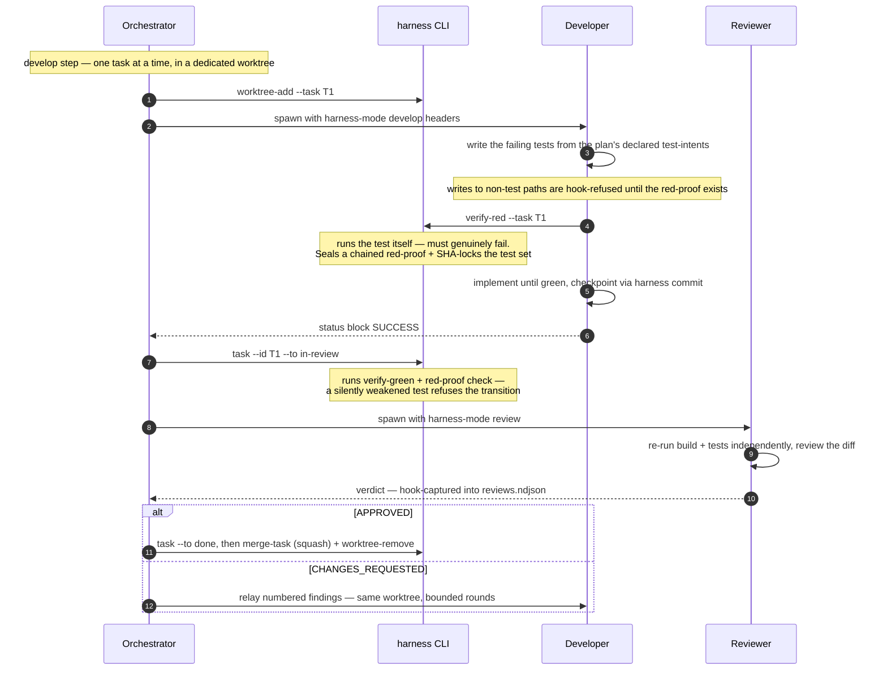

# ai-sdlc-harness · v3.0

**A governed multi-agent SDLC pipeline for Claude Code** — a ground-up rewrite of [ai-sdlc-harness](https://github.com/MostAshraf/ai-sdlc-harness). Drives a real engineering workflow — fetch → plan → proven-red TDD → review → security → PR → comment rounds → reconcile → metrics — across one or many repos. No application code lives here: only the pipeline manifest, the Python core that enforces it, and the agents, skills, and hooks that run it.

| Command | Purpose |
|---|---|
| `/init-workspace` | One-time setup interview: provider, repos, discovered toolchain, verification gate |
| `/dev-workflow <work-item-id>` | Take a work item from requirements to merged PR end-to-end |
| `/story-workflow <command> <work-item-id>` | Shape a story's quality before it's built: `analyze` · `refine` · `improve` · `groom` |
| `/workflow-status` | Read-only dashboard: cursor, tasks, gates, flagged events per run |
| `/workspace-config` | Change one config section without re-running the interview |
| `/add-repo` | Register one new repo into an already-bootstrapped workspace |
| `/migrate-workspace` | Adopt a v2.x workspace: config carries over, run history stays archived in place |
| `/repo-map-refresh` | Regenerate the auto-generated codebase map the planner grounds its plans in |

## The rewrite, in one table

The original harness works, but almost all of its accumulated complexity compensates for one root cause: *orchestration logic lived in markdown prose an LLM had to faithfully execute, with hooks bolted on to catch the cases where it didn't.* The rewrite moves every mechanical rule into code that just runs, and reserves the model for judgment.

| Concern | ai-sdlc-harness (v2.x) | ai-sdlc-harness (v3.0) |
|---|---|---|
| Pipeline definition | Prose phase files the orchestrator re-derives every run; a separate hardcoded copy in guard scripts | One declared manifest ([pipeline/manifest.yaml](pipeline/manifest.yaml)) read by **both** the orchestrator and the enforcement layer — no second copy to drift |
| Git operations | Raw `git` calls reverse-engineered after the fact by `shlex`-parsing hooks | Owned entry points (`harness commit` / `merge-task` / `sync-branch` / `push` …); the raw verbs are blocked outright |
| Workflow state | `tracker.md`, honor-system updates | HMAC-chain-sealed `state.yaml` + append-only ndjson evidence ledgers — tamper-evident, `exit 3` on out-of-band edits |
| Human gates | The model reads your reply and acts on it | A hook captures your reply verbatim; deterministic code parses the decision — the model cannot approve on your behalf |
| TDD enforcement | Separate Tester and Developer subagents per task (token/latency tax) | One developer writes test + implementation; `harness verify-red` *proves* the failure and blob-SHA-locks the test set until completion |
| Providers | Markdown capability docs an agent must correctly read | Code modules behind one interface, each held to a shared contract test |
| Agents | 7 role files fusing permissions with procedure | 3 fixed tool-grant *shapes* (planner / developer / reviewer); procedure lives in shared step files |
| File-size budgets | Retrofitted after files passed 400 lines | ~100/200-line budget enforced from day one (`tools/budget_check.py`) |

## Install

Not yet published to a plugin marketplace — run it from a local clone:

```sh
git clone <this-repo> ai-sdlc-harness
claude --plugin-dir /path/to/ai-sdlc-harness
```

Then, inside Claude Code:

```
/init-workspace
```

The interview asks only what it must (provider, repos), *discovers* your toolchain (proposing the test command it found), and offers **default** for everything else. It bootstraps a plugin-owned Python venv (PEP 668-safe — no system-python changes), ends with a verification gate — every check passes or you don't proceed — and writes per-section config under `.claude/context/`, a permission allowlist into `.claude/settings.json` (no manual `settings.json` editing needed), and the bootstrap marker.

## Prerequisites

| Dependency | Why |
|---|---|
| **Claude Code** | The CLI that runs this harness. Install from [claude.ai/code](https://claude.ai/code). |
| **Git** | Branch management, per-task worktree isolation, owned commits. |
| **Python 3.10+** | The entire core is Python. `/init-workspace` creates the plugin's own venv with PyYAML as its first step; until then the guards print a one-line notice and stand down. |
| **Provider CLI, authed** *(optional)* | `gh auth login` / `glab auth login` / `az login`, if using that provider. MCP providers need their server connected. The `local-markdown` provider needs nothing at all. |

Target repos must be **cloned locally**, clean, and on their default branch when registered — the harness does not clone them. No language prerequisites; toolchains are discovered.

---

## Workflow at a Glance

```mermaid
flowchart LR
    classDef orch fill:#dde6fa,stroke:#446,stroke-width:1.5px,color:#013
    classDef agent fill:#fff7d8,stroke:#b80,stroke-width:1px,color:#530
    classDef human fill:#fff1de,stroke:#a60,stroke-width:1px,color:#420
    classDef output fill:#eaf3ff,stroke:#36b,stroke-width:1px,color:#024

    F([fetch + classify]):::orch
    I[intake]:::agent
    P[plan]:::agent
    G1{approve-plan}:::human
    PF[preflight]:::orch
    D[develop — proven-red TDD per task]:::agent
    G2{approve-impl}:::human
    H[harden]:::agent
    S[security scan]:::orch
    G25{approve-security, when findings meet the threshold}:::human
    QR[quick-recheck]:::orch
    PP[pre-pr review]:::agent
    G3{approve-pre-pr}:::human
    FX[pre-pr-fixes]:::agent
    CP[create-pr]:::output
    AC[analyze-comments]:::agent
    G4{select-comments}:::human
    AF[apply-fixes]:::agent
    RC[reconcile]:::output
    M[metrics]:::output

    F -->|full| I --> P --> G1
    G1 -->|approved| PF
    G1 -->|rejected| P
    F -->|quick| PF
    PF --> D
    D -->|full| G2
    G2 -->|approved| H --> S
    G2 -->|rejected| D
    S -->|below threshold| PP
    S -->|findings meet the threshold| G25
    G25 -->|waive / defer| PP
    G25 -->|fix-now| D
    D -->|quick| QR
    QR -->|clean| PP
    QR -->|dirty — escalate to full| S
    PP --> G3
    G3 -->|approved| CP
    G3 -->|rejected| FX --> PP
    CP --> RC --> M
    CP -.->|on demand, repeatable| AC --> G4 --> AF -.-> RC
    AF -.->|new comments| AC
```



**Full mode** has three unconditional human gates (plan, implementation, pre-PR), one conditional gate (security — fires only when the aggregate finding severity meets the configured threshold, default `medium`), and one multi-pick gate (comment selection, inside the on-demand PR-comments group). **Quick mode** — trivial changes classified at fetch — keeps only the pre-PR gate. Everything between gates runs hands-off.

At **any** cursor position, an ad-hoc human request is legal: it spawns the reviewer in `request-triage` mode (a declared always-legal spawn), which classifies the request against the approved plan. Out-of-scope requests surface back to you with explicit options — never silently merged.

## The Per-Task TDD Loop



`task --to done` mechanically **refuses** without a captured `APPROVED` verdict in the ledger — the orchestrator can't paraphrase a review into an approval. Rejection rounds are bounded (`review_rounds.max`, default 5); beyond that the rework transition is refused and you are escalated, on the theory that round N+ signals plan drift, not code drift.

---

## The Agent Shapes

Instead of one file per role fusing "who may do what" with "what procedure to follow", there are three fixed tool-grant **shapes**; the procedure lives in per-mode step files under [skills/dev-workflow/steps/](skills/dev-workflow/steps/) that the shape reads at spawn time.

| Shape | Modes | Tool grant | Guard-enforced restriction |
|---|---|---|---|
| **planner** | `intake` · `plan` · `repo-map` | Read/Grep/Glob/Write/Edit/Bash | Writes only under `ai/<run>/` and `.claude/context/` — never repo source |
| **developer** | `develop` · `harden` · `fixup` | Read/Grep/Glob/Write/Edit/Bash | Works only inside its task worktree; non-test writes refused until the task's red-proof is sealed |
| **reviewer** | `review` · `pre-pr` · `analyze-comments` · `request-triage` | Read/Grep/Glob/Bash | Strictly read-only — no Write/Edit granted, shell writes blocked (a literal `/tmp` scratch path is the one exception); builds and test runs allowed, so it verifies independently instead of trusting another agent's claim |

The **orchestrator** (the main Claude Code conversation running `/dev-workflow`) is deliberately thin: a coordinator that walks the manifest, spawns shapes with structured `harness-mode:` headers, and calls `harness` verbs. It never writes code, never touches run-authority files directly, and never runs raw git — the guards block those paths and point it back to the owned verbs.

## Key Concepts

### The run directory

Everything for one work item lives under a single directory keyed by date + work-item ID (same-day re-runs after an abort get a `-2`, `-3` suffix slot):

```
ai/2026-07-08-PROJ-123/
├── state.yaml            # THE authority: cursor, tasks, artifacts, gate decisions — HMAC-chain-sealed
├── work-item.json        # fetched + provider-normalized work item
├── requirements.md       # intake output
├── plan.md               # edge cases, risk tiers, test-intents, approach options, diagrams
├── events.ndjson         # every deviation: test revisions, rejections, blocks, stalls, skipped gates
├── tokens.ndjson         # real per-invocation token spend
├── reviews.ndjson        # hook-captured reviewer verdicts (what "done" transitions check)
├── human-input.ndjson    # your gate replies, captured verbatim — never leaves the workspace
├── .redproof/            # sealed per-task red-proofs (read only via `harness show-redproof`)
└── reports/              # security.md, pre-pr.md, metrics.md, coverage
```

### Sealed state and evidence ledgers

`state.yaml` is HMAC-chained (key at `.claude/context/.harness-key`, pinned into git's exclude list and refused by the commit verbs if ever staged). Any out-of-band edit fails verification: every CLI verb exits `3` and refuses to proceed until you inspect and run `harness reseal`. The ndjson ledgers are append-only and chained the same way. At gate crossings, `publish-mirror` commits a **path-exclusive** snapshot of `ai/<run>/` onto your feature branch — minus `human-input.ndjson`, the red-proofs, and lockfiles — so the audit trail travels with the PR while your raw chat text stays local.

### Human gates

Your reply at a gate is captured verbatim by a `UserPromptSubmit` hook into `human-input.ndjson`; `harness gate --decide` then derives the decision from that evidence with a deterministic parser. The grammar:

- **`APPROVED`** — exactly. A qualified approval ("approved, but also…") is *not* an approval; it routes to ad-hoc request triage.
- **A numbered option** or the option's exact word (e.g. `2`, `waive`).
- **Rejection-side options may lead the reply and carry notes** (`rejected — split T2 into…`); forward decisions stay bare by design.
- The comment-selection gate additionally takes a comma-separated pick (`1,3`) or the literal `NONE`.

Gate presentations, skips (a conditional gate whose predicate didn't fire), and rejections are all ledgered; `/workflow-status` surfaces the flagged events.

### Proof-anchored TDD

The property that matters — *the test genuinely failed before the fix existed* — without the original's two-agent tax:

1. The developer writes the failing tests first. This ordering is **hook-enforced**, not advisory: until the red-proof exists, writes to non-test paths in the worktree are refused (test paths, fixtures, and build manifests for test dependencies stay writable — patterns configurable per language in [config/defaults/workflow.yaml](config/defaults/workflow.yaml)).
2. `harness verify-red` runs the test itself — it must fail — then seals a chained red-proof and blob-SHA-locks the test files plus their declared closure (shared fixtures, `conftest.py`, …).
3. The completion transition runs `verify-green` **and** re-checks the locked SHAs: a quietly weakened assertion refuses the transition.
4. A genuinely wrong test is revised via `verify-red --revise --reason "…"` — an explicit, reviewer-visible flagged event, never a silent edit.
5. Tasks a plan explicitly marks with no test-intents (docs, chores) are the approved opt-out: verify-red refuses, the completion guard exempts, review still applies.

### Owned git entry points

Once a workspace has completed `/init-workspace`, raw commit-creating / history-rewriting git verbs (`commit`, `merge`, `rebase`, `cherry-pick`, `revert`, `am`, `pull`, `push`) are blocked for Claude for the life of that workspace — the guard cannot know a "harness" commit from any other, so it blocks the whole verb rather than trying to tell one commit's intent from another's (your own terminal outside Claude Code is unaffected, and a session that has never run `/init-workspace` sees ordinary git — see [Guardrail Hooks](#guardrail-hooks)). Mutations go through owned verbs that validate, execute, and ledger in one place: `commit` (declared classes `working`/`wip`, `--fixup-of`), `merge-task` (squash / `--autosquash` fold), `worktree-add`/`worktree-remove`, `sync-branch` (owned rebase), `push` (`--force-with-lease`), and `publish-mirror`. Branch and commit naming come from [config/defaults/naming.yaml](config/defaults/naming.yaml).

### Quick mode — with a mechanical escape hatch

Trivial changes (explicit `Mode: quick` hint in the work item, no risk keywords) run the short pipeline: no plan step, no red-proof machinery, one gate. Because eligibility was classified *before code existed*, `quick-recheck` re-examines the **real diff** after develop: touching disqualifying patterns (security/auth/migration/API paths) or exceeding size caps (80 changed lines / 5 files, configurable) triggers the declared escalation edge into full mode's security step — forcibly, not at the model's discretion.

### The security step

`security-scan` runs each repo's configured `scan_cmd`, parses severities via the configured regex, and records the aggregate maximum. The gate fires only at or above `security.gate_threshold` (default `medium`), with three dispositions: **fix-now** (routes back to develop), **waive** (recorded, pipeline continues), **defer** (pipeline continues *and* a follow-up work item is created via the provider, with paired ledger events so an in-flight, completed, or dropped deferral are distinguishable states).

### Multi-repo runs

A work item spanning repos gets per-repo task lanes; cross-repo API contracts are declared in the plan and mechanically re-checked at reconcile time (`reconcile-contracts` greps each declared fragment across the other repos' sources, excluding test paths and the committed `ai/**` mirrors). Sync points fail closed: the cursor cannot leave `develop` while any task in any lane is non-terminal.

### The repo map

`/init-workspace` (optionally) and `/repo-map-refresh` generate a tiered codebase map under `.claude/context/repo-map/` — directories and modules by purpose, key abstractions, notable patterns — stamped with the SHA it was generated at and flagged stale after 50 commits (configurable). A map with no content cannot be stamped, so an empty generation can never be certified fresh. The planner's intake and plan instructions point it at the map directly (index first, then only the areas the story touches) instead of re-deriving the codebase from scratch every run. Auto-generated only, never hand-maintained: corrections go through regeneration.

## Guardrail Hooks

One Python entry point ([hooks/guards.py](hooks/guards.py)) handles every event, registered in [hooks/hooks.json](hooks/hooks.json). Guards scope themselves to workspaces with a live harness run (resolved from `CLAUDE_PROJECT_DIR` first, so a drifted shell `cwd` can't dodge them) — with one exception: the raw-git block is standing rather than run-scoped, active for the life of any workspace that has completed `/init-workspace` (same `CLAUDE_PROJECT_DIR`-first resolution, checking for the bootstrap marker instead of a live run) regardless of whether a run currently exists. It is still not global — a session that has never run `/init-workspace` sees ordinary git. Two documented residuals: a session rooted directly in a repo registered to a *sibling* workspace, rather than the workspace itself, isn't recognized as belonging to it (nothing today points from a registered repo back to the workspace that owns it); and the bootstrap marker itself (`.claude/context/overrides.yaml`) is an ordinary, non-chain-sealed config file — a direct edit stripping it can silently turn the block back off, a capability the pre-change unconditional block never had. Both accepted deliberately rather than closed in this pass — see `_is_harness_workspace`'s docstring.

| Guard | Event · Matcher | What it enforces |
|---|---|---|
| bash | PreToolUse · Bash | Blocks raw history-mutating git inside any workspace that has completed `/init-workspace` and points to the owned verbs. Role-aware shell-write analysis (quote-masked shape matching on redirects, `tee`, `cp`/`mv`, in-place editors): reviewer writes only to literal `/tmp` paths; developer confined to its worktree; secret/evidence files unreadable. |
| write | PreToolUse · Write/Edit/MultiEdit/NotebookEdit | Path confinement per shape (planner → `ai/<run>/` + `.claude/context/`; developer → its worktree with the pre-red test-first lock; reviewer → nothing) plus sensitive-file patterns. |
| spawn | PreToolUse · Agent/Task | Only the spawn-set the manifest declares for the current cursor is legal — shape *and* `harness-mode:` header both checked; out-of-run spawns (e.g. repo-map generation) must be declared in [pipeline/surfaces.yaml](pipeline/surfaces.yaml). Fail-closed. |
| skill | PreToolUse · Skill | USER-ENTRY skills (`/dev-workflow`, `/init-workspace`, …) refuse invocation from subagents or autonomous triggering — they run only when you ran them. |
| read | PreToolUse · Read/Grep | Red-proofs are readable by harness shapes only via `harness show-redproof` (chain-verified) — a raw `.redproof/` read skips integrity verification and is blocked. |
| prompt capture | UserPromptSubmit | Verbatim capture of your replies into `human-input.ndjson` — the only evidence `gate --decide` accepts. |
| verdict capture | PostToolUse · Agent/Task | The authoritative writer of `reviews.ndjson` (reviewer verdicts) and missing-status-block events — anchored here because this payload deterministically carries both the spawn prompt and the agent's final reply. |
| stop capture | SubagentStop | Per-invocation token accounting into `tokens.ndjson`; secondary status-block capture. |

Every guard's fail-open/fail-closed policy is chosen deliberately and tested: recognised violations always block; the spawn guard is fail-closed even on ambiguity.

## The `harness` CLI

All ~49 owned verbs run through the wrapper `${CLAUDE_PLUGIN_ROOT}/bin/harness` (resolves the plugin venv in either OS layout, falls back to system `python3`/`python`). It runs on macOS, Linux, and Windows — on Windows it executes under Git Bash, with `bin/harness.cmd` as the cmd.exe sibling. Agents call it; you rarely need to — except `abort`.

| Group | Verbs |
|---|---|
| Workspace setup | `init` · `discover` · `ensure-default-branch` · `init-verify` · `init-section` · `init-finalize` · `add-repo` · `migrate-detect` · `migrate-extract` · `resolve-model` · `resolve-coverage-cmd` |
| Pipeline steps | `fetch` · `preflight` · `plan-register` · `quick-recheck` · `security-scan` · `reconcile-contracts` · `create-pr` · `fetch-pr-comments` · `reconcile` · `write-back` · `metrics` |
| State & evidence | `bootstrap` · `cursor` · `task` · `artifact` · `gate` · `stall` · `log-event` · `verify` · `show` · `status` · `abort` · `complete` · `reseal` |
| TDD proof | `verify-red` (and `--revise`) · `show-redproof` |
| Git (owned) | `worktree-add` · `worktree-remove` · `commit` · `merge-task` · `sync-branch` · `push` · `publish-mirror` |
| Providers & misc | `provider` · `provider-normalize` · `validate-mermaid` · `repo-map-check` · `repo-map-stamp` |

Exit codes: `0` ok · `1` refused (read the JSON `error`) · `2` usage error · `3` integrity violation (a sealed file changed out-of-band — recover with `harness reseal` after review).

## Providers

Work-item integrations are code modules behind one interface — callers name an *operation* (`work_item.fetch`, `work_item.create`, `create-pr`, …), never a provider — and every module must pass the shared contract test in [tests/test_providers.py](tests/test_providers.py). Adding a provider = implementing the interface.

| Provider | Transport | Needs |
|---|---|---|
| `local-markdown` | files | Nothing — work items are `.md` files in a configured stories directory |
| `github` | CLI (`gh`) | `gh auth login` |
| `gitlab` | CLI (`glab`) | `glab auth login` |
| `ado` | CLI (`az boards`) | `az login` + DevOps extension |
| `ado-mcp` | MCP | Azure DevOps MCP server connected |
| `jira` | MCP | Jira MCP server connected |
| `zoho` | MCP | Zoho MCP server connected |

CLI/file-transport providers execute inside the harness process. MCP-transport providers can't be script-called: the module declares a tool **mapping**, the model invokes the MCP tool, and pipes the raw result to `harness fetch --from-raw` for the same shared normalize + bootstrap path.

## Project Structure

```
ai-sdlc-harness/
├── .claude-plugin/plugin.json   # plugin manifest
├── pipeline/
│   ├── manifest.yaml            # THE pipeline source of truth: steps, modes, gates, escalations
│   ├── task-fsm.yaml            # legal task-status transitions
│   └── surfaces.yaml            # subagent shapes, write surfaces, out-of-run spawns
├── config/defaults/             # shipped knobs (workflow, naming, quick-mode, review-policy,
│                                #   status-mapping, subagent-models) — overrides live in the
│                                #   workspace's .claude/context/
├── harness/                     # the Python core behind every owned verb
│   ├── cli.py                   # verb surface
│   ├── workflow.py              # step implementations
│   ├── state.py · transitions.py · gates.py · chain.py   # sealed state + FSM + gate parser
│   ├── gitops.py                # owned git machinery
│   ├── migrate.py               # v2.x workspace adoption (the fork seam)
│   └── providers/               # code-modular provider adapters
├── hooks/
│   ├── hooks.json               # hook registrations
│   └── guards.py                # all guard + capture logic (one entry point)
├── agents/                      # the 3 shapes: planner.md, developer.md, reviewer.md
├── skills/
│   ├── dev-workflow/            # thin orchestrator walker + per-step instruction files
│   └── init-workspace/ · add-repo/ · migrate-workspace/ · workspace-config/ · workflow-status/ · repo-map-refresh/
├── bin/harness                  # wrapper script resolving the plugin venv (+ harness.cmd for Windows)
├── tools/                       # meta-tooling: line-budget checker, sandbox workspace generators
└── tests/                       # 606 stdlib-unittest tests
```

Workspace artifacts — `ai/<date>-<id>/` and `.claude/context/` — are generated inside *your* working directory by `/init-workspace` and the pipeline. They never live inside this plugin repo.

## Development

Requires Python 3.10+ and PyYAML. CI runs the suite on Linux, macOS, and Windows — all three lanes enforcing.

```sh
python3 -m venv .venv && .venv/bin/pip install pyyaml
.venv/bin/python -m harness.schema          # validate all declared data against the fixed vocabulary
.venv/bin/python tools/budget_check.py      # line budget + duplication sweep
.venv/bin/python -m unittest discover -s tests
```

On Windows the venv lands its interpreter under `Scripts\` instead of `bin/`:

```powershell
python -m venv .venv; .venv\Scripts\pip install pyyaml
.venv\Scripts\python -m unittest discover -s tests
```

The test suite (606 tests) covers the state engine, gate grammar, guard behavior (via subprocess against real payloads), provider contracts, git machinery against real temp repos, breadth walks of both pipeline modes, composability probes (a scratch mode and scratch step must validate and walk with zero Python changes), Windows-only guard path shapes, and meta-checks (invocation consistency, declared-data schema, line budgets). See [CHANGELOG.md](CHANGELOG.md) for release history.

## FAQ

**Can I resume after closing the terminal?** Yes — `state.yaml` *is* the resume point. Start a new session in the same workspace, run `/workflow-status` to see where you are, then `/dev-workflow <id>`: it detects the live run and offers **Resume or Abort** — never clobbers.

**How do I abandon a run?** `harness abort --run <run> --reason "<why>"` (via the plugin's `bin/harness`). Terminal: sweeps worktrees, keeps the full audit trail, frees the work item. A same-day re-run gets a fresh `-2` suffix slot; nothing is deleted.

**What does exit code 3 mean?** A sealed file (`state.yaml`, a ledger, a red-proof) changed outside the owned verbs. Every verb refuses until you inspect the diff and run `harness reseal` — deliberately loud, because silent tolerance would make the audit trail worthless.

**Why can't Claude run `git commit` in my harness workspace?** The guard can't distinguish a harness commit from any other, so it blocks the whole verb for the life of any workspace that has completed `/init-workspace` — regardless of whether a run is currently active. Your own terminal outside Claude Code is unaffected, and a project that has never run `/init-workspace` is unaffected too. If you need raw git inside a bootstrapped workspace, disable the plugin for that session.

**What if the reviewer keeps rejecting?** Rounds are bounded (`review_rounds.max`, default 5). Beyond that the rework transition is refused and you're escalated — persistent rejection signals plan drift, not code drift.

**What if an agent stalls or returns garbage?** A missing/invalid status block is detected mechanically; the orchestrator re-invokes with a continuation prompt (bounded, default 2), then escalates to you (default 3). It never acts on the agent's behalf.

**What if a test is genuinely wrong after it was proven red?** `harness verify-red --revise --reason "<why>"` — the revision is sealed and flagged in the events ledger, reviewer-visible. There is no silent path.

**What happens on a security finding?** Below the threshold: recorded, pipeline continues. At/above: the gate fires with **fix-now** (back to develop), **waive** (recorded), or **defer** — defer also creates a follow-up work item through your provider, with paired events so a dropped deferral is detectable.

**How do I trust what a run did?** Read the ledgers. `events.ndjson` records every deviation (test revisions, gate rejections, blocked actions, stalls, skipped gates), `tokens.ndjson` the real spend, `reviews.ndjson` the verdicts, and the chained `state.yaml` the decisions — all mirrored onto the feature branch at gate crossings (minus your raw replies). `/workflow-status` and `harness metrics` are deterministic projections of the same files.

**I'm coming from ai-sdlc-harness v2.x — can I migrate my workspace?** Yes — run `/migrate-workspace` in it. Config carries over as per-section proposals you confirm (provider, repos, test commands, stories directory), applied through the same verification gate as a fresh setup; the old markdown configs are archived to `.claude/context/legacy-2.1/` with a migration report. Run history is never converted — v3.0 state is sealed evidence v2.x never produced — so old `ai/` run dirs stay in place as readable archives, and in-flight v2.x stories finish on v2.x (or are abandoned) before you switch. Existing `local-markdown` stories work in place, including their `> Status:` blockquotes.
