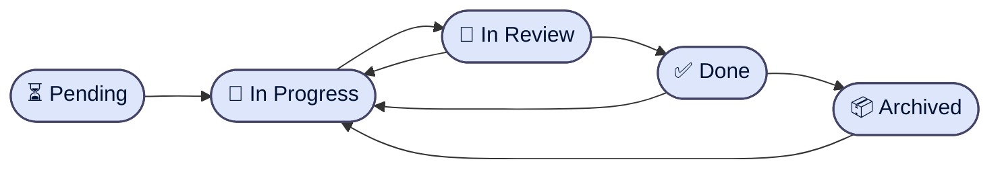

# Tracker Transition Rules

> Owner: cross-cutting
> Version: 2.0

<!-- Created by: dev-workflow-plan.md [M-01] [IMPL-01-11]
     Revised: aligned with what `_tracker_transition_guard.py` actually enforces and what
     `plan-generator/tracker-schema.md` actually renders. The previous version declared a
     5-state FSM that excluded `In Review` and included a status-emoji `Aborted` — neither
     matched the hook, the schema doc, or any tracker the planner ever rendered. This
     version separates the two vocabularies cleanly:
       1. The **task-row Status FSM** (what the hook enforces, what the planner renders).
       2. The **Story-State header field** (a derived enum for the story as a whole).
     CC conventions applied: CC-04.2, CC-04.4, CC-08.1 (single source for the task FSM). -->

## Purpose

Canonical finite-state machine for the per-task `Status` column in every tracker section (Main, Amendments, Ad-hoc, Pending Requests). The hook `_tracker_transition_guard.py` references this file rather than defining the FSM inline — per CC-08.1 the FSM is owned here once and consumed by the hook, the planner row writer, and the metrics collector.

This file is **not** the row writer. Row templates (concrete Markdown rendered into the tracker by the Planner) live in [`plan-generator/tracker-schema.md`](../../skills/plan-generator/tracker-schema.md) under each `MODE` heading.

## Two vocabularies, one tracker

The tracker carries two distinct status signals — they share no states and must not be conflated:

| Vocabulary | Where | States | Enforcer |
|---|---|---|---|
| **Task-row Status** | `Status` column in every task table row | 5 — see below | `_tracker_transition_guard.py` (PreToolUse on Edit/Write/MultiEdit against tracker paths) |
| **Story-State header** | `Story-State:` header field at the top of the tracker | 5 — see "Story-State enum" below | Orchestrator only; no hook |

`In Review` exists in the task FSM only. `Archived` / `Aborted` exist in the Story-State only. Cross-pollinating them was the design flaw the v1.0 of this file shipped with.

## Task-row Status FSM (the hook's domain)

### States (exactly 5)

| Symbol | Meaning |
|---|---|
| `⏳ Pending` | Created but no work started. Initial state on every new row. |
| `🔧 In Progress` | An agent is actively working in the lane. |
| `🔄 In Review` | Reviewer has been invoked, awaiting verdict. |
| `✅ Done` | Reviewer approved and (where applicable) squash-merged. |
| `📦 Archived` | P8 reconciliation moved the row out of the active set. Reachable only via M-07 `commands/reconcile.md`; M-19 `commands/hotfix.md` operates on a **clone**, the original Archived row is preserved. |

### Allowed transitions



Tabular form:

| From | To | Trigger | Owner |
|---|---|---|---|
| *(new row)* | `⏳ Pending` | Row appended to an existing tracker (must enter Pending; no born-Done loophole) | Planner / Orchestrator (per row source) |
| `⏳ Pending` | `🔧 In Progress` | Lane starts (P3 Step 0) | `develop` / `test` |
| `🔧 In Progress` | `🔄 In Review` | Agent emits SUCCESS / DONE_WITH_CONCERNS | Orchestrator after agent verdict |
| `🔄 In Review` | `✅ Done` | Reviewer Verdict = APPROVED | Orchestrator after reviewer verdict |
| `🔄 In Review` | `🔧 In Progress` | Reviewer Verdict = CHANGES_REQUESTED | Orchestrator after reviewer verdict |
| `✅ Done` | `🔧 In Progress` | Rework — Phase 6 fixup, Phase 7 amendment retrigger, GATE #5 batch re-triggers a `T-TEST-*` row | Orchestrator |
| `✅ Done` | `📦 Archived` | P8 reconciliation `Workflow completed` | `reconcile` (M-07) |
| `📦 Archived` | `🔧 In Progress` | Hotfix re-entry on a clone | `hotfix` (M-19) — operates on a clone, the original `Archived` row is not modified |

### Forbidden transitions

Any transition not listed above is **rejected** at the hook layer with stderr:

```
tracker-transition-guard: illegal status transition(s)
  - T<n>: <from> → <to>
```

Specifically:

- `⏳ Pending → ✅ Done` (skipping work) — forbidden.
- `⏳ Pending → 🔄 In Review` (skipping the in-progress lane) — forbidden.
- `📦 Archived → ✅ Done` — forbidden (Archived is terminal except via Hotfix on a clone).
- Adding a new row already past `⏳ Pending` (e.g. starting in `🔧 In Progress`) — forbidden.

### Hook enforcement

`scripts/_tracker_transition_guard.py`:

- **Event**: `PreToolUse` on `Edit | Write | MultiEdit`.
- **Matcher**: `tool_input.file_path` matches `**/ai/tasks/*.md` (legacy) or `**/ai/<YYYY-MM-DD>-<id>/tracker(.archived|.aborted)?.md` (canonical M-14 layout).
- **Policy**: fail-closed (exit 2 blocks the write).
- **Enforces**: the allowed-transition table above.
- **Reads**: the on-disk tracker + the proposed edit's resulting content; computes per-task before/after status diffs.
- **Writes**: nothing.

## Story-State header field

The `Story-State:` header field at the top of every tracker records the workflow's overall position. It is a **separate enum** from the task-row FSM — no hook enforces it; the orchestrator writes it directly. Per `agents/shared/tracker-field-schema.md`:

| State | Meaning | Set by |
|---|---|---|
| `Pending` | Tracker created, no task has started | Planner at tracker creation (P2) |
| `In Progress` | At least one task is in `🔧 In Progress` or `🔄 In Review` | Orchestrator on first lane start (P3 Step 0) |
| `Done` | All main-table tasks `✅ Done`, PR merged | Orchestrator after `Merge detected` (P8) |
| `Archived` | Post-P8 reconciliation; tracker file is renamed to `tracker.archived.md` | `reconcile` (M-07) |
| `Aborted` | Workflow terminated before completion via `/dev-workflow abort`; tracker file is renamed to `tracker.aborted.md` | `resume` / `abort` (M-08) |

Note that `Archived` and `Aborted` correspond to **file renames** (`tracker.md → tracker.archived.md` / `tracker.aborted.md`) per `workflow-paths.md`. The header field on the renamed file carries the same value; the file rename is the durable signal.

There is no FSM diagram for Story-State — the transitions are linear (`Pending → In Progress → Done → Archived`) with a sideways branch to `Aborted` from any non-terminal state. The orchestrator owns the writes; no hook validates them.

## Reviewer-Verdict — third vocabulary, not a status

Per `agents/shared/status-schema.md`, the per-task `Reviewer Verdict` column carries a separate enum: `APPROVED | CHANGES_REQUESTED | IN_REVIEW | —`. `IN_REVIEW` here is the Reviewer's mid-run sentinel value (the verdict cell shows `IN_REVIEW` while the Reviewer is computing), distinct from the task-row `🔄 In Review` status. These two vocabularies happen to share the English word "In Review" but they are independent: the Status column is FSM-enforced; the Verdict column is informational.

## Consumers

| Consumer | Use |
|---|---|
| `scripts/_tracker_transition_guard.py` | Enforces the task-row FSM |
| `skills/plan-generator/tracker-schema.md` | Documents the per-task Status enum + legal transitions; cross-references this file |
| `skills/dev-workflow/commands/develop.md` | Per-task `⏳ Pending → 🔧 In Progress → 🔄 In Review → ✅ Done` |
| `skills/dev-workflow/commands/test.md` | `✅ Done → 🔧 In Progress` re-trigger on Phase 5 hardening |
| `skills/dev-workflow/commands/reconcile.md` (M-07) | `✅ Done → 📦 Archived` |
| `skills/dev-workflow/commands/hotfix.md` (M-19) | `📦 Archived → 🔧 In Progress` on a clone |
| `skills/dev-workflow/commands/resume.md` (M-08) | Sets Story-State to `Aborted`, renames the tracker file |
| P9 `skills/metrics-collector/SKILL.md` | Reads transitions for cycle-time computation |
