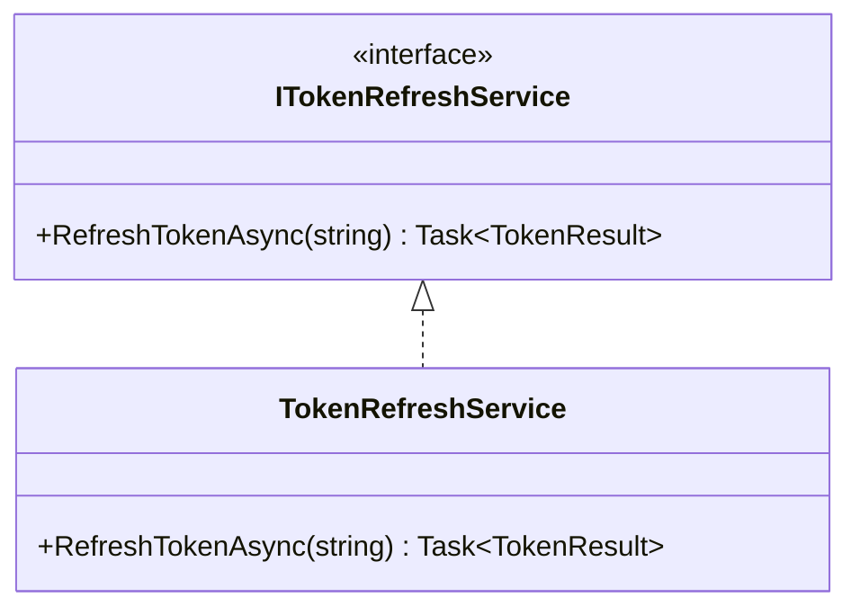
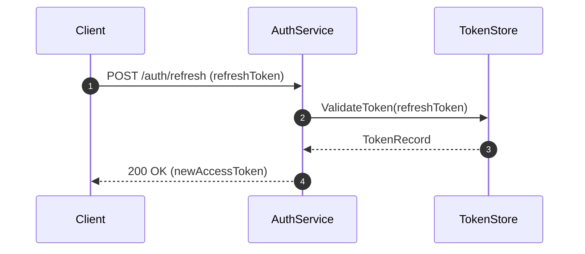

# Plan Generator

## Purpose

Take a validated requirements summary and produce a comprehensive implementation plan with atomic tasks, class diagrams, flow charts, sequence diagrams, and a task tracker file.

## Inputs

- `$ARGUMENTS[0]` — Work Item / Issue ID (e.g., `123456` for ADO/GitLab/GitHub, `PROJ-123` for Jira)
- `$ARGUMENTS[1]` — Brief kebab-case slug (e.g., `token-refresh-service`)

## Steps

### 0. Design Approach Selection

Before decomposing into tasks, propose 2-3 architectural approaches. For each approach provide:
- A short name and one-line summary
- High-level design: which layers, services, and types are involved
- Trade-offs: complexity, performance, maintainability, risk

Present using the `🏗️ DESIGN APPROACHES` block format and include your recommendation with reasoning. **Wait for the human to select an approach before proceeding.**

The selected approach informs all subsequent steps — task decomposition, diagrams, and file structure must align with it.

### 1. Pre-Flight

Read ALL existing tracker files in `ai/tasks/` matching `*$ARGUMENTS[0]*` to check for prior session work.

### 1b. Repo Identification (Multi-Repo)

Read `.claude/context/repos-metadata.md` and `.claude/context/repos-paths.md` to understand the repo landscape. Based on the requirements, identify which repos are affected:

- Map each requirement/change to the repo that owns that domain area
- If only one repo is affected, all tasks share the same Repo value
- If multiple repos are affected, tag each task with the correct repo
- Identify **cross-repo boundaries** — where repos communicate (HTTP API calls, Service Bus messages, shared DTOs). These will be defined as contracts so all repos can develop in parallel.

### 2. Task Decomposition

Break the story into ordered, atomic tasks. For each task:

| Field | Description |
|-------|-------------|
| **Task ID** | T1, T2, T3, ... T-TEST-\<RepoName\> |
| **Repo** | Target repo name (from repos-metadata.md) |
| **Title** | Short descriptive name |
| **Description** | What this task accomplishes |
| **Files** | Files to create or modify (full paths relative to repo root) |
| **Dependencies** | Which other tasks in the **same repo** must complete first |
| **Complexity** | S (< 30 min), M (30-90 min), L (> 90 min) |

**Multi-repo rules:**
- Tasks within the same repo must respect dependency ordering
- Dependencies are **intra-repo only** — tasks never depend on tasks in other repos
- All repo lanes run fully in parallel (contracts eliminate cross-repo blocking)
- Create one `T-TEST-<RepoName>` per affected repo (e.g., `T-TEST-AuthService`, `T-TEST-BillingService`)

### 2b. Cross-Repo Contracts (Multi-Repo Only)

When repos communicate at runtime (HTTP API calls, Service Bus messages, shared DTOs), define the **contracts** upfront so both sides can develop in parallel without waiting.

For each cross-repo boundary, produce a contract definition:

| Field | Description |
|-------|-------------|
| **Contract ID** | C1, C2, C3, ... |
| **Type** | `HTTP API` \| `Service Bus Message` \| `Shared DTO` |
| **Producer** | Repo that owns/exposes the contract |
| **Consumer** | Repo(s) that depend on the contract |
| **Definition** | Full signature: endpoint path + HTTP method + request/response DTOs, or message topic + payload schema |

**Example:**
```
C1 — HTTP API
  Producer: BillingService
  Consumer: ApiGateway
  Definition:
    PUT /api/v1/customers/{customerId}/subscription
    Request:  UpdateSubscriptionRequest { PlanId: string, BillingCycle: string, ... }
    Response: SubscriptionResponse { Id: Guid, Status: string, ... }

C2 — Service Bus Message
  Producer: BillingService
  Consumer: AuthService
  Definition:
    Topic: subscription-changed
    Payload: SubscriptionChangedEvent { CustomerId: Guid, SubscriptionId: Guid, Action: string }
```

Each developer receives the relevant contracts as context alongside their task. The developer implements **against** the agreed contract — the other side does not need to exist yet.

The reviewer verifies contract compliance: the producer's implementation matches the contract definition, and the consumer codes against the same contract.

### 3. Class Diagram

Produce a Mermaid `classDiagram` showing:
- New types being introduced
- Modified existing types
- Relationships (inheritance, composition, dependency)
- Key methods and properties



### 4. Flow Chart

Produce a Mermaid `flowchart TD` showing:
- The runtime flow introduced or changed
- Decision points
- External system interactions
- Error paths

### 4b. Sequence Diagram

Produce a Mermaid `sequenceDiagram` showing:
- The end-to-end interaction between actors (clients, services, repos, external systems)
- Order of calls and messages
- Synchronous vs asynchronous interactions
- Key response or event payloads



### 5. Produce Test Outline

For each task T(n) in the task breakdown, produce a Test Outline that lists the unit/integration tests the Tester will implement in Phase 3 before the Developer touches production code.

**Format per task:**
```markdown
## Test Outline

### T1: <task title>
`test-required: true`
- `MethodName_Scenario_ExpectedResult` — one-line description of what behaviour it validates and which acceptance criterion it covers (e.g. AC-2)
- `MethodName_EdgeCase_ExpectedResult` — ...

### T2: <task title>
`test-required: false` — <one-line justification, e.g. "dependency bump covered by existing suite" or "pure config change with no branching logic">
```

**Rules:**
- Name tests using the `Subject_Scenario_Outcome` convention matching the project's test adapter (see `language-config.md`).
- Include at least one happy-path, one error/edge-case, and one security/boundary test per acceptance criterion where meaningful.
- Mark `test-required: false` for tasks with no observable behaviour: pure-config changes, dependency version bumps, file renames, scaffolding.
- The Test Outline is presented to the human at GATE #1 alongside the plan and must be approved before Phase 3 begins.

### 6. Save Plan Document

Save to: `ai/plans/$(date +%Y-%m-%d)_$ARGUMENTS[0]_$ARGUMENTS[1].md`

The plan document must include:
1. Story metadata (ID, title, sprint)
2. Requirements summary
3. **Affected repos** (list of repos with justification for each)
4. **Cross-repo contracts** (if multi-repo: full contract definitions for all inter-repo boundaries — API signatures, message schemas, shared DTOs)
5. Selected design approach (name, summary, and why it was chosen)
6. **Test Outline** (per-task list of test names + intent; `test-required` flag per task)
7. Task breakdown table (with Repo column)
8. Class diagram
9. Flow chart
10. Sequence diagram
11. Conventions reference (link to `.claude/context/conventions.md` — the single authoritative conventions file)
12. Risk/assumptions section
13. Attribution footer (last line): `🤖 Generated with [Claude Code](https://claude.ai/claude-code)`

### 7. Create Task Tracker

Save to: `ai/tasks/$(date +%Y-%m-%d)_$ARGUMENTS[0]_$ARGUMENTS[1]_${CLAUDE_SESSION_ID}.md`

Before writing the tracker, run `date -u +"%Y-%m-%d %H:%M UTC"` and use the output as the `Workflow started` value. All other metrics must remain `—` — they are filled in at their respective phase transitions, not now.

**CRITICAL**: Use this EXACT column schema. Do NOT invent, rename, remove, or reorder columns. Every tracker row must have exactly 7 pipe-separated columns.

Format:
```markdown
# Task Tracker — <Story Title> (<Story-ID>)

| Task ID | Repo | Title | Status | Reviewer Verdict | Commit(s) | Notes |
|---------|------|-------|--------|------------------|-----------|-------|
| T1 | AuthService | ... | ⏳ Pending | — | — | test-required: true |
| T2 | AuthService | ... | ⏳ Pending | — | — | Depends on T1 |
| T3 | BillingService | ... | ⏳ Pending | — | — | test-required: false |

Column definitions:
- **Task ID**: T1, T2, ... for dev tasks
- **Repo**: Must match a repo name from repos-paths.md
- **Title**: Brief description of the task
- **Status**: One of ⏳ Pending, 🔧 In Progress, 🔄 In Review, ✅ Done
- **Reviewer Verdict**: ✅ Approved, 🔄 Changes Requested, or — (not yet reviewed)
- **Commit(s)**: Squash-merge commit hash(es) filled in by the orchestrator after approval (— until then)
- **Notes**: Must include `test-required: true` or `test-required: false`. Also note cross-repo dependencies, caveats, or review comment references.

**Legend:** ⏳ Pending · 🔧 In Progress · 🔄 In Review · ✅ Done

---

## Repo Status

| Repo | Local Path | Branch | Default Branch |
|------|-----------|--------|----------------|
| AuthService | /home/dev/repos/auth-service | <team>/feature/<story-id>-<slug> | main |
| BillingService | /home/dev/repos/billing-service | <team>/feature/<story-id>-<slug> | main |

*(Populated from repos-paths.md and repos-metadata.md. For single-repo stories, this table has one row.)*

---

## Workflow Metrics

| Metric | Value |
|--------|-------|
| **Workflow started** | <!-- output of: date -u +"%Y-%m-%d %H:%M UTC" --> |
| **Plan approved** | — |
| **Development started** | — |
| **Development completed** | — |
| **Human approval (impl)** | — |
| **Test hardening started** | — |
| **Test hardening completed** | — |
| **PR created** | — |

### Task Metrics

| Task ID | Started | Completed | Review Rounds | Build Retries | Test Written | Green At |
|---------|---------|-----------|---------------|---------------|--------------|----------|
| T1 | — | — | 0 | 0 | — | — |
| T2 | — | — | 0 | 0 | — | — |
| T3 | — | — | 0 | 0 | — | — |

---

## Review History

*(Populated by the orchestrator during Phase 3 whenever a Reviewer returns CHANGES_REQUESTED.
Empty if all tasks were approved on the first pass. The development flow is never paused for
these entries — they are recorded for human review at GATE #2.)*

---
🤖 Generated with [Claude Code](https://claude.ai/claude-code)
```

**Notes:**
- `Test Written`: timestamp when the Tester commits the failing tests for a `test-required: true` task (filled by orchestrator after Tester AGENT STATUS parsed). Leave `—` for `test-required: false` tasks.
- `Green At`: timestamp when the Developer commits passing implementation (filled by orchestrator after Developer AGENT STATUS parsed).
- For single-repo stories, the Repo column still appears with one value throughout. The `Repo Status` section has one row.
- There are no `T-TEST-<RepoName>` tracker rows. Phase 5 (Test Hardening) runs as a post-phase operation; the orchestrator records its outcome in Workflow Metrics, not as task rows.

### 8. Present for Approval

Display the full plan — including the Test Outline — to the human user and explicitly request:

> **🚦 GATE: Please review this plan and Test Outline and respond with APPROVED to proceed, or describe the changes you'd like.**

Do NOT proceed until receiving approval.

## Rules

- Tasks must be **atomic** — each should be implementable and reviewable independently.
- Tasks within the same repo must be **sequential** — respect dependency ordering.
- Tasks in different repos always run in **parallel** — cross-repo contracts eliminate blocking.
- Dependencies are **intra-repo only**. Cross-repo boundaries are resolved via contracts defined in step 2b.
- Every task must have a **Repo** column value matching a repo name from `repos-metadata.md`.
- Every task must have `test-required: true` or `test-required: false` in its Notes column.
- Every `test-required: true` task must have a corresponding Test Outline entry with at least one test name.
- Do NOT include `T-TEST-<RepoName>` rows in the tracker. Phase 5 (Test Hardening) is tracked via Workflow Metrics.
- The **Repo Status** section must be populated from `repos-paths.md` and `repos-metadata.md`.
- The plan is the **contract** — all agents will reference it as the source of truth.
