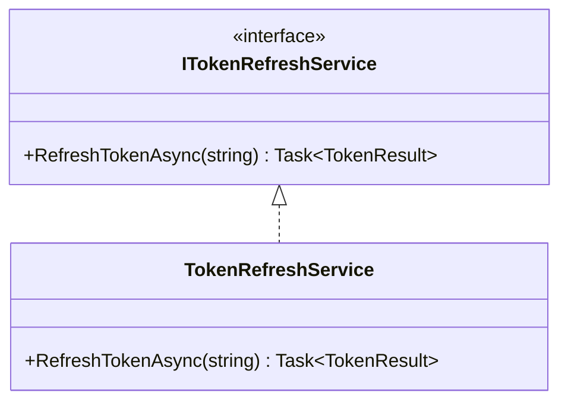
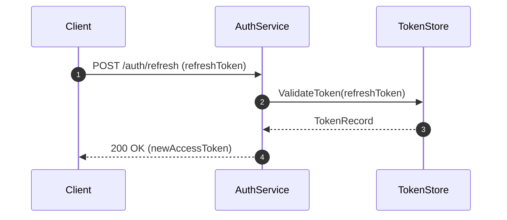
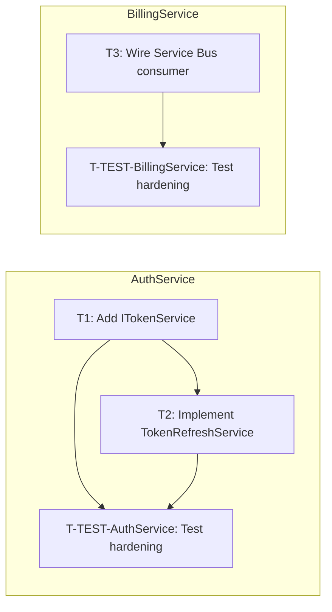

# Plan Generator

## Purpose

Take a validated requirements summary and produce a comprehensive implementation plan with atomic tasks, class diagrams, flow charts, sequence diagrams, and a task tracker file.

## Inputs

- `$ARGUMENTS[0]` — Work Item / Issue ID (e.g., `123456` for ADO/GitLab/GitHub, `PROJ-123` for Jira)
- `$ARGUMENTS[1]` — Brief kebab-case slug (e.g., `token-refresh-service`)

## Steps

### 0a. Minimum-Input Gate (bounces back to story-intake on failure)

Before proposing approaches or reading any code, verify the requirements summary is
substantive enough to plan against. The Planner is expensive — a thin or empty summary
produces an unplanable mess that wastes the human's review time at GATE #1.

Check, in order:

1. **Description present.** The requirements summary must include a non-empty
   `Description` (or equivalent narrative) section. A single-line title is not enough.
2. **At least one acceptance criterion.** The summary must declare at least one entry
   under `## Acceptance Criteria` (or the provider-specific section the
   `story-intake` skill normalises to). An empty AC list means there's no behavioural
   contract to plan against.
3. **At least one repo configured.** Read `.claude/context/repos-metadata.md` and
   confirm at least one repo row is declared. A workspace with no repos cannot host
   any of the tasks the Planner would produce.

If any of these checks fails, **STOP**. Do not proceed to Step 0. Surface this to the
human and bounce back to `story-intake`:

```
## Plan generation aborted — requirements summary is below the minimum input bar

  - Description: <present | MISSING>
  - Acceptance criteria count: <N>
  - Configured repos (repos-metadata.md): <N>

The Planner cannot produce a usable plan from this. Re-run
`/dev-workflow plan <story-id>` after one of:
  [1] Re-running `/story-intake <story-id>` so the requirements summary is
      filled in (description, ACs).
  [2] Re-running `/init-workspace` if `repos-metadata.md` is empty.
  [3] Editing the requirements summary manually if you want to bypass intake.
```

End the invocation with `Outcome: BLOCKED`.

The repo-identification check in Step 1b is the **secondary** gate — if the requirements
implicate zero of the configured repos, Step 1b bounces back with the same message
shape. This Step 0a check only verifies the inputs are non-trivial, not that they map
to a specific repo.

### 0. Design Approach Selection

Before decomposing into tasks, propose 2-3 architectural approaches. For each approach provide:
- A short name and one-line summary
- High-level design: which layers, services, and types are involved
- Trade-offs: complexity, performance, maintainability, risk

Present using the `🏗️ DESIGN APPROACHES` block format and include your recommendation with reasoning. **Wait for the human to select an approach before proceeding.**

The selected approach informs all subsequent steps — task decomposition, diagrams, and file structure must align with it.

### 1. Pre-Flight

Read ALL existing tracker files in `ai/tasks/` matching `*$ARGUMENTS[0]*` to check for prior session work.

### 1b. Repo Identification (Multi-Repo)

Read `.claude/context/repos-metadata.md` and `.claude/context/repos-paths.md` to understand the repo landscape. Based on the requirements, identify which repos are affected:

- Map each requirement/change to the repo that owns that domain area
- If only one repo is affected, all tasks share the same Repo value
- If multiple repos are affected, tag each task with the correct repo
- Identify **cross-repo boundaries** — where repos communicate (HTTP API calls, Service Bus messages, shared DTOs). These will be defined as contracts so all repos can develop in parallel.

### 1c. Dependency Version Pre-Flight

For each affected repo, build a version map of its direct dependencies:

1. Read `key_dependencies` from `.claude/context/language-config.md` for the repo. If the field is absent or empty:
   - If the trailing comment is `# manifest unsupported`, the version map is deliberately empty for this repo (the manifest is out of scope per `language-discovery.md`). Hold an empty map; do not retry by reading the manifest yourself.
   - Otherwise (the workspace was initialised before `key_dependencies` was added, or the value was wiped), fall back to reading the repo's primary dependency manifest directly — identified by `project_root_markers` in `language-config.md`. Apply the same extraction rules as language-discovery Phase 2 (pom.xml, package.json, go.mod, pyproject.toml are supported; for any other format, hold an empty map).

2. Hold the version map in context for use in step 2. You will not write it to the plan; it informs annotations only.

**Annotation rule (applied in step 2):** for every task whose Description prescribes a specific named method, type, or API on a library:

- If the library appears in the version map with a concrete version, append `[API: <lib> v<version>]` to that task's **Notes** column — e.g., `test-required: true · [API: some-library v2.3.0]`. This is the developer's prompt to verify the method signature against docs for that exact version before implementing.
- If the version map is empty (manifest unsupported / unreadable) **or** the library is not present in the map, **omit the annotation entirely**. Do not invent a placeholder like `v?`, `v0`, or `v(unknown)`; a guessed version is worse than no annotation because the Developer would still consult docs but with a wrong anchor.
- Omit the annotation for tasks with no library API usage (pure config, dependency bumps, scaffolding).

### 2. Task Decomposition

Break the story into ordered, atomic tasks. For each task:

| Field | Description |
|-------|-------------|
| **Task ID** | T1, T2, T3, ... T-TEST-\<RepoName\> |
| **Repo** | Target repo name (from repos-metadata.md) |
| **Title** | Short descriptive name |
| **Description** | What this task accomplishes |
| **Files** | Files to create or modify (full paths relative to repo root) |
| **Dependencies** | Which other tasks in the **same repo** must complete first |
| **Complexity** | S (< 30 min), M (30-90 min), L (> 90 min) |

**Multi-repo rules:**
- Tasks within the same repo must respect dependency ordering
- Dependencies are **intra-repo only** — tasks never depend on tasks in other repos
- All repo lanes run fully in parallel (contracts eliminate cross-repo blocking)
- Create one `T-TEST-<RepoName>` per affected repo (e.g., `T-TEST-AuthService`, `T-TEST-BillingService`)

**Dependency notation (machine-readable, parsed by the orchestrator):**

Record intra-repo dependencies as a single comma-separated token in the tracker row's
**Notes** column using the form `depends: T<n>[, T<n>...]`. The orchestrator parses this
token in Phase 3 to gate lane progression (see `commands/develop.md` Step 1 sub-step 1).

- Tasks with no dependencies omit the token — do not write `depends: none`.
- Combine with other Notes tokens via `·` separator. Example:
  - `test-required: true · depends: T1 · [API: some-library v2.3.0]`
  - `test-required: true · depends: T1, T2`
- Only Task IDs in the **same repo** are valid. Cross-repo dependencies are not allowed —
  use contracts instead.
- The token must match the regex `depends:\s*T[A-Za-z0-9-]+(\s*,\s*T[A-Za-z0-9-]+)*` so the
  orchestrator's lane-gating parser succeeds. Whitespace around commas is tolerated;
  trailing commas are not.

### 2b. Cross-Repo Contracts (Multi-Repo Only)

When repos communicate at runtime (HTTP API calls, Service Bus messages, shared DTOs), define the **contracts** upfront so both sides can develop in parallel without waiting.

For each cross-repo boundary, produce a contract definition:

| Field | Description |
|-------|-------------|
| **Contract ID** | C1, C2, C3, ... |
| **Type** | `HTTP API` \| `Service Bus Message` \| `Shared DTO` |
| **Producer** | Repo that owns/exposes the contract |
| **Consumer** | Repo(s) that depend on the contract |
| **Definition** | Full signature: endpoint path + HTTP method + request/response DTOs, or message topic + payload schema |

**Example:**
```
C1 — HTTP API
  Producer: BillingService
  Consumer: ApiGateway
  Definition:
    PUT /api/v1/customers/{customerId}/subscription
    Request:  UpdateSubscriptionRequest { PlanId: string, BillingCycle: string, ... }
    Response: SubscriptionResponse { Id: Guid, Status: string, ... }

C2 — Service Bus Message
  Producer: BillingService
  Consumer: AuthService
  Definition:
    Topic: subscription-changed
    Payload: SubscriptionChangedEvent { CustomerId: Guid, SubscriptionId: Guid, Action: string }
```

Each developer receives the relevant contracts as context alongside their task. The developer implements **against** the agreed contract — the other side does not need to exist yet.

The reviewer verifies contract compliance: the producer's implementation matches the contract definition, and the consumer codes against the same contract.

### 3. Class Diagram

Produce a Mermaid `classDiagram` showing:
- New types being introduced
- Modified existing types
- Relationships (inheritance, composition, dependency)
- Key methods and properties



### 4. Flow Chart

Produce a Mermaid `flowchart TD` showing:
- The runtime flow introduced or changed
- Decision points
- External system interactions
- Error paths

### 4b. Sequence Diagram

Produce a Mermaid `sequenceDiagram` showing:
- The end-to-end interaction between actors (clients, services, repos, external systems)
- Order of calls and messages
- Synchronous vs asynchronous interactions
- Key response or event payloads



### 5. Produce Test Outline

For each task T(n) in the task breakdown, produce a Test Outline that lists the unit/integration tests the Tester will implement in Phase 3 before the Developer touches production code.

**Format per task:**
```markdown
## Test Outline

### T1: <task title>
`test-required: true`
- `MethodName_Scenario_ExpectedResult` — one-line description of what behaviour it validates and which acceptance criterion it covers (e.g. AC-2)
- `MethodName_EdgeCase_ExpectedResult` — ...

### T2: <task title>
`test-required: false` — <one-line justification, e.g. "dependency bump covered by existing suite" or "pure config change with no branching logic">
```

**Rules:**
- Name tests using the `Subject_Scenario_Outcome` convention matching the project's test adapter (see `language-config.md`).
- Include at least one happy-path, one error/edge-case, and one security/boundary test per acceptance criterion where meaningful.
- Mark `test-required: false` for tasks with no observable behaviour: pure-config changes, dependency version bumps, file renames, scaffolding.
- The Test Outline is presented to the human at GATE #1 alongside the plan and must be approved before Phase 3 begins.

### 5b. Test Pattern References (Bounded Pattern-Hint Discovery)

For every task with `test-required: true`, produce a short list of 0–2 existing test files in the target repo that would be useful patterns for the Tester to consult. The Tester reads these *instead of* roaming the tree looking for analogous tests at Phase 3 time — the FE-008 retrospective showed unbounded pattern-discovery research is a primary cause of sub-agent watchdog stalls.

**Heuristic — strictly filename-globbing only. No semantic comparison, no advisor calls, no reading file contents.** The Planner runs at most 5 globs per task and returns at most 2 matches, ranked by file modification time (newest first). If no globs match, the task's pattern list is empty.

**Procedure for each `test-required: true` task:**

1. **Determine the repo's test root** from `language-config.md` for the target repo (`test_root` field if present, else the language's default — `tests/` for Python, `test/` for Java, `__tests__` or `tests/` for JS/TS, `*_test.go` siblings for Go, etc.).

2. **Extract 1–3 distinctive tokens from the task title** — pick noun phrases that describe the *what*, not the *how*. Examples:
   - Task title "Add drawer for subscription edit" → tokens `drawer`, `subscription`
   - Task title "Refactor token-refresh service to async" → tokens `token-refresh`, `refresh`
   - Task title "Wire up Service Bus consumer for billing events" → tokens `service-bus`, `billing`
   - One-word generic titles ("Add validation", "Fix bug") → fewer tokens; expect zero matches and don't force it.

3. **Run filename globs** against the test root using these patterns (in this order, stopping after 5 globs total per task):
   - `<test_root>/**/*<token>*.spec.*` (e.g. `tests/**/*drawer*.spec.ts`)
   - `<test_root>/**/*<token>*.test.*`
   - `<test_root>/**/test_*<token>*.*` (Python convention)
   - `<test_root>/**/*<token>*_test.*` (Go convention)
   - `<test_root>/**/harden-*<token>*.*` (story-prefixed pattern, if used by the repo)

4. **Rank and trim**: collect all matches, dedupe, sort by modification time (newest first via `stat -c %Y` on Linux or `stat -f %m` on macOS, or `git log -1 --format=%ct <file>` for a Git-anchored fallback), and keep the top 2.

5. **Output format** — per task in the plan document:
   ```markdown
   ### T<n>: <task title>
   Patterns:
   - <repo-relative path> — matched on `<token>`, modified <YYYY-MM-DD>
   - <repo-relative path> — matched on `<token>`, modified <YYYY-MM-DD>
   ```
   If zero matches: `Patterns: (none — Tester will use test framework defaults)`.

**Bounds (non-negotiable):**

- Globbing is finite — `Glob` returns immediately or not at all; no recursion past the test root.
- At most 5 globs × 1 candidate-token sweep per task. The Planner does NOT keep retrying with broader patterns. "No match" is a valid answer.
- **The Planner does NOT read the contents of any candidate file.** Filename match is the entire signal. Rationale: file-content semantic comparison is what stalled the Tester at Phase 3 in the FE-008 retro; relocating that to Phase 2 just shifts the stall earlier.
- The output is a *suggestion*. The human reviews these patterns at GATE #1 and may strike or replace any line before approving the plan.

The approved Patterns list per task is inlined verbatim into the Tester's prompt as a `TEST PATTERN HINTS` block (see `prompt-templates.md` → `PATTERN_HINTS_CTX`).

### 6. Save Plan Document

**Before saving**, run these commands:
```bash
date -u +%Y-%m-%d   # capture as TODAY (UTC — canonical per orchestrator-rules #14)
# Derive WORKSPACE_ROOT: it is the directory whose .claude/context/ holds provider-config.md
# You already read repos-paths.md from .claude/context/ in step 1b — use its parent's parent
```
Save to: `$WORKSPACE_ROOT/ai/plans/TODAY_<story-id>_<slug>.md`
where TODAY is the output of the date command above (e.g. 2026-04-25) and WORKSPACE_ROOT is
the absolute path derived above.

The plan document must include:
1. Story metadata (ID, title, sprint)
2. Requirements summary
3. **Affected repos** (list of repos with justification for each)
4. **Cross-repo contracts** (if multi-repo: full contract definitions for all inter-repo boundaries — API signatures, message schemas, shared DTOs)
5. Selected design approach (name, summary, and why it was chosen)
6. **Test Outline** (per-task list of test names + intent; `test-required` flag per task)
7. **Test Pattern References** (per-task list of 0–2 existing test files to consult; produced by Step 5b. The human reviews these at GATE #1 and may edit them before approval.)
8. Task breakdown table (with Repo column)
9. Class diagram
10. Flow chart
11. Sequence diagram
12. Conventions reference (link to `.claude/context/conventions.md` — the single authoritative conventions file)
13. Risk/assumptions section
14. Attribution footer (last line): `🤖 Generated with [Claude Code](https://claude.ai/claude-code)`

### 7. Create Task Tracker

**Before saving**, run this command and capture the output as `TODAY`:
```bash
date -u +%Y-%m-%d   # UTC — canonical per orchestrator-rules #14
```
Save to: `$WORKSPACE_ROOT/ai/tasks/TODAY_<story-id>_<slug>.md`
where TODAY is the output of the command above and WORKSPACE_ROOT is the same absolute path
derived in Step 6.

Before writing the tracker, run `date -u +"%Y-%m-%d %H:%M UTC"` and use the output as the `Workflow started` value. All other metrics must remain `—` — they are filled in at their respective phase transitions, not now.

**CRITICAL**: Use this EXACT column schema. Do NOT invent, rename, remove, or reorder columns. Every tracker row must have exactly 7 pipe-separated columns.

**REQUIRED: After the task table you MUST write a `## Dependency Graph` section** containing a Mermaid `flowchart LR`. This section is mandatory for every story — single-repo and multi-repo alike. Do NOT skip it or omit it under any circumstances.

The graph is a static visual companion to the task table — status is NOT encoded; the table is the single source of truth for status. The graph is regenerated only when Phase 7 (PR review response) adds new tasks; the orchestrator never modifies it mid-workflow.

**Dependency Graph rendering rules:**

1. **Direction:** `flowchart LR` — left-to-right reads as execution order (dependencies on
   the left, dependents on the right).
2. **Node IDs:** Replace every `-` in a Task ID with `_` for the Mermaid node ID, since
   some renderers reject `-` in node identifiers. The display label keeps the original ID
   verbatim. Example: `T-TEST-AuthService` → node ID `T_TEST_AuthService`, label
   `T-TEST-AuthService: Test hardening`.
3. **Labels:** `<Task ID>: <title>` with the title truncated to 40 characters (append `…`
   if cut). Wrap the label in `[...]` for rectangle nodes.
4. **Edges:** for every `depends: T<a>, T<b>...` token in the task's Notes, draw
   `T<a> --> T<this>` and `T<b> --> T<this>`. Tasks with no `depends:` token become root
   nodes (no incoming edges).
5. **Implicit T-TEST edges:** every dev task `T<n>` in repo `R` MUST have an edge to
   `T-TEST-<R>` (Phase 5 hardening cannot begin until all dev tasks in the repo are Done).
   Render these edges explicitly even though the `depends:` token doesn't carry them — the
   graph captures the full execution DAG, including Phase 5.
6. **Multi-repo grouping:** if the story affects two or more repos, wrap each repo's tasks
   in a `subgraph <RepoName>` block (use the bare repo name as the subgraph title; no
   quotes). For single-repo stories, emit a flat graph with no `subgraph` wrapping.
7. **No node styling:** do not emit `classDef`, `:::class` modifiers, fill colours, or
   stroke overrides. The table holds status; the graph holds dependencies only.
8. **Edge placement:** declare all nodes (inside subgraphs if multi-repo) first, then list
   every edge below the subgraph blocks. Edges crossing subgraph boundaries are valid only
   if a contract forced an intra-repo dependency to reference another repo's task — which
   is NOT allowed (cross-repo dependencies are forbidden, see rule above on intra-repo
   dependencies). Reject any rendering attempt that would produce a cross-subgraph edge.

The Format block below shows the multi-repo case. For a single-repo story, omit both
`subgraph` blocks and list nodes + edges flat.

Format:
````markdown
# Task Tracker — <Story Title> (<Story-ID>)

| Task ID | Repo | Title | Status | Reviewer Verdict | Commit(s) | Notes |
|---------|------|-------|--------|------------------|-----------|-------|
| T1 | AuthService | ... | ⏳ Pending | — | — | test-required: true |
| T2 | AuthService | ... | ⏳ Pending | — | — | test-required: true · depends: T1 |
| T3 | BillingService | ... | ⏳ Pending | — | — | test-required: false |
| T-TEST-AuthService | AuthService | Test hardening | ⏳ Pending | — | — | Phase 5 |
| T-TEST-BillingService | BillingService | Test hardening | ⏳ Pending | — | — | Phase 5 |

Column definitions:
- **Task ID**: T1, T2, ... for dev tasks; T-TEST-\<RepoName\> for Phase 5 test hardening
- **Repo**: Must match a repo name from repos-paths.md
- **Title**: Brief description of the task
- **Status**: One of ⏳ Pending, 🔧 In Progress, 🔄 In Review, ✅ Done
- **Reviewer Verdict**: ✅ Approved, 🔄 Changes Requested, or — (not yet reviewed)
- **Commit(s)**: Squash-merge commit hash(es) filled in by the orchestrator after approval (— until then)
- **Notes**: Must include `test-required: true` or `test-required: false`. For intra-repo dependencies, include the canonical `depends: T<n>[, T<n>...]` token (parsed by the orchestrator in Phase 3). Multiple Notes tokens are joined with ` · ` separators. Also note caveats or review comment references.

**Legend:** ⏳ Pending · 🔧 In Progress · 🔄 In Review · ✅ Done

---

## Dependency Graph
<!-- REQUIRED — always present; generated from task `depends:` tokens + implicit T-TEST edges -->



---

## Repo Status

| Repo | Local Path | Branch | Default Branch |
|------|-----------|--------|----------------|
| AuthService | /home/dev/repos/auth-service | <team>/feature/<story-id>-<slug> | main |
| BillingService | /home/dev/repos/billing-service | <team>/feature/<story-id>-<slug> | main |

*(Populated from repos-paths.md and repos-metadata.md. For single-repo stories, this table has one row.)*

---

## Workflow Metrics

| Metric | Value |
|--------|-------|
| **Workflow started** | <!-- output of: date -u +"%Y-%m-%d %H:%M UTC" --> |
| **Plan approved** | — |
| **Development started** | — |
| **Development completed** | — |
| **Human approval (impl)** | — |
| **Test hardening started** | — |
| **Test hardening completed** | — |
| **PR created** | — |

### Task Metrics

| Task ID | Started | Completed | Review Rounds | Build Retries | Test Written | Green At |
|---------|---------|-----------|---------------|---------------|--------------|----------|
| T1 | — | — | 0 | 0 | — | — |
| T2 | — | — | 0 | 0 | — | — |
| T3 | — | — | 0 | 0 | — | — |
| T-TEST-AuthService | — | — | 0 | 0 | N/A | N/A |
| T-TEST-BillingService | — | — | 0 | 0 | N/A | N/A |

---

## Review History

*(Populated by the orchestrator during Phase 3 whenever a Reviewer returns CHANGES_REQUESTED.
Empty if all tasks were approved on the first pass. The development flow is never paused for
these entries — they are recorded for human review at GATE #2.)*

---
🤖 Generated with [Claude Code](https://claude.ai/claude-code)
````

**Notes:**
- `Test Written`: timestamp when the Tester commits the failing tests for a `test-required: true` task (filled by orchestrator after Tester AGENT STATUS parsed). Leave `—` for `test-required: false` tasks; `N/A` for T-TEST rows.
- `Green At`: timestamp when the Developer commits passing implementation (filled by orchestrator after Developer AGENT STATUS parsed). `N/A` for T-TEST rows.
- For single-repo stories, the Repo column still appears with one value throughout. The `Repo Status` section has one row.
- `T-TEST-<RepoName>` rows track Phase 5 test hardening — one per affected repo. The orchestrator updates them through the same status lifecycle (Pending → In Progress → In Review → Done) as dev tasks.

### 8. Present for Approval

Display the full plan — including the Test Outline and the Test Pattern References — to the human user. When summarising, call out the Pattern References explicitly so the human knows to scan them:

> **🚦 GATE: Please review this plan, the Test Outline, and the Test Pattern References (per-task list of existing test files the Tester will consult) and respond with APPROVED to proceed, or describe the changes you'd like.**
>
> *Patterns are filename-glob suggestions. If any look irrelevant, strike them — empty pattern lists are fine; the Tester will fall back to framework defaults.*

Do NOT proceed until receiving approval.

## Phase 7 Amendment Mode (`MODE: pr-response-tasks`)

When the orchestrator invokes this skill with `MODE: pr-response-tasks` (from
`skills/dev-workflow/commands/review-response.md` Step 7 after PR review comments
have been classified VALID/PARTIAL and accepted at GATE #4), the skill operates in
**amendment mode** instead of producing a fresh plan.

### What changes in amendment mode

- **Skip Step 0a** (the minimum-input gate) and Step 0 (Design Approach Selection).
  The plan and tracker already exist; design approach was settled in the original
  Phase 2 run.
- **Skip Step 1** (pre-flight check for prior session work). Existing tracker is
  the input, not a discovery target.
- **Skip Step 7's "Create Task Tracker"** for a fresh file. Open and modify the
  **existing** tracker referenced in the orchestrator's prompt.
- **Skip Step 8** (HUMAN GATE #1). The human already gated this batch of tasks at
  GATE #4 in `review-response.md`. The amendment write-back must be silent.

### What stays the same

- Step 1b — re-read `repos-metadata.md` and verify each new task's `Repo` value
  resolves to a configured repo.
- Step 5 (Test Outline) — every amendment task with `test-required: true` must
  have a corresponding Test Outline entry appended to the plan file under a new
  `## Test Outline — PR Review Round N` heading. Follow the existing
  `Subject_Scenario_Outcome` naming convention.
- Step 5b (Test Pattern References) — applies to amendment tasks too. Append to
  the existing pattern-references section keyed by the new Task IDs.
- Step 6 (Mermaid diagrams) — regenerate the **Dependency Graph** in the tracker
  to include the new tasks (per the existing rendering rules above). Amendment
  tasks typically have no `depends:` token because they originate from PR
  feedback rather than the original DAG, so they appear as root nodes with the
  implicit Phase 5 edge into `T-TEST-<RepoName>`.

### Amendment row template

Append new task rows under a new `## Amendments (PR Review Round N)` heading
**below** the existing task table — do NOT reorder, edit, or remove any existing
rows. Existing rows record history (commits, verdicts, completion timestamps);
mutating them would corrupt the trail.

The amendment heading uses the round number passed by the orchestrator (`Round 1`
on the first Phase 7 invocation, `Round 2` on a second round of PR comments, etc).

Tracker format for amendment rows — identical column schema as the original
table:

```markdown
## Amendments (PR Review Round <N>)

| Task ID | Repo | Title | Status | Reviewer Verdict | Commit(s) | Notes |
|---------|------|-------|--------|------------------|-----------|-------|
| T<next-n> | <repo-name> | <≤ 60-char title> | ⏳ Pending | — | — | PR-comment: [PC-<n>] thread_id=<provider-thread-id> · test-required: <true|false> |
```

The `Notes` column **must** include the `PR-comment: [PC-<n>] thread_id=<...>`
token so `review-response.md` Step 9 can later post replies on the original
threads. The `thread_id` value is the REST integer comment ID for inline review
threads or `general:<comment-id>` for top-level PR comments (per
`skills/providers/<git-provider>/pr-comments.md`).

### Task ID continuation

Identify the highest existing Task ID in the original table (e.g. if the last
dev task is `T5`, the first amendment task is `T6`). T-TEST-`<RepoName>` rows
are not part of the dev-task sequence and are not assigned to amendment tasks —
amendment tasks reuse the existing T-TEST-`<RepoName>` row for their repo's
Phase 5 hardening (it remains the single Phase 5 anchor per repo across rounds).

### Status transitions

Every amendment row MUST start in `⏳ Pending`. The `tracker-transition-guard`
hook enforces this — appending a row already in `✅ Done` is rejected.

## Rules

- Tasks must be **atomic** — each should be implementable and reviewable independently.
- Tasks within the same repo must be **sequential** — respect dependency ordering.
- Tasks in different repos always run in **parallel** — cross-repo contracts eliminate blocking.
- Dependencies are **intra-repo only**. Cross-repo boundaries are resolved via contracts defined in step 2b.
- Every task must have a **Repo** column value matching a repo name from `repos-metadata.md`.
- Every task must have `test-required: true` or `test-required: false` in its Notes column.
- Every `test-required: true` task must have a corresponding Test Outline entry with at least one test name.
- Include one `T-TEST-<RepoName>` row per affected repo. These track Phase 5 test hardening through the same Pending → In Progress → In Review → Done lifecycle as dev tasks.
- The **Repo Status** section must be populated from `repos-paths.md` and `repos-metadata.md`.
- The plan is the **contract** — all agents will reference it as the source of truth.
