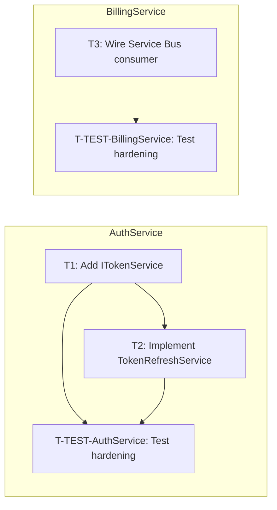

# Tracker Schema Reference

**This file is authoritative for the tracker schema.** Single source of truth
for column shapes, status / verdict / disposition enums, legal status
transitions, Notes-column tokens, section ownership, and the meaning of every
Workflow Metrics and Task Metrics field. Edit this file **first** when adding
or renaming any of them — every other file in the harness defers here rather
than carrying its own copy of the vocabulary.

**What this file is not**: it is not the row-writer for any section. Row
templates (concrete Markdown rendered into the tracker by the Planner) live
in [`SKILL.md`](SKILL.md) under each `MODE` heading. The templates exist for
the Planner's prompt; this file exists for the schema's meaning. When the two
disagree, this file wins and the template should be patched.

> **Where used**: [`plan-generator/SKILL.md`](SKILL.md) (canonical row
> writer), [`dev-workflow/commands/develop.md`](../dev-workflow/commands/develop.md)
> (transitions during Phase 3), [`dev-workflow/commands/review-response.md`](../dev-workflow/commands/review-response.md)
> (Phase 7 amendments), [`dev-workflow/commands/handle-request.md`](../dev-workflow/commands/handle-request.md)
> (ad-hoc batches and deferred requests), [`workflow-status/SKILL.md`](../workflow-status/SKILL.md)
> (section-aware reading), [`tracker-transition-guard`](../../scripts/_tracker_transition_guard.py)
> (status validation).

## Sections

Every tracker has up to **five section types**. Sections appear in the order
below; later sections are absent until the relevant phase or event creates them.

| Order | Heading | Owner | Created in | Mutable after creation? |
|-------|---------|-------|------------|-------------------------|
| 1 | *(no heading — the first table after the document title)* | Planner | Phase 2 (`plan-generator` Step 7) | Status / Verdict / Commit(s) / Notes by orchestrator only; row schema frozen |
| 2 | `## Pending Requests` | **Orchestrator** | Inter-gate, on `handle-request.md` Step 1 (mid-triage in-flight requests) | Append-only on capture; row deleted at terminal disposition (task creation or `## Deferred Requests` append). `Re-renders` cell mutable during matrix re-render loops. |
| 3 | `## Amendments (PR Review Round <N>)` | Planner | Phase 7 (`MODE: pr-response-tasks`) | Status / Verdict / Commit(s) / Notes by orchestrator only; row schema frozen |
| 4 | `## Ad-hoc Tasks (Batch <N>)` | Planner | Inter-gate (`MODE: ad-hoc-tasks`) | Status / Verdict / Commit(s) / Notes by orchestrator only; row schema frozen |
| 5 | `## Deferred Requests` | **Orchestrator** (not the Planner) | Inter-gate, on `[2]/[b]/[c]/[d]/[g]/[SKIP-ALL]` at GATE #5 | Append-only by orchestrator |

There can be **zero or more** Amendment / Ad-hoc sections — one heading per
round or batch, monotonically numbered (`Round 1`, `Round 2`, …; `Batch 1`,
`Batch 2`, …). The numbering is global across the story; restarting at 1 in
a new session is a planner error.

The `## Pending Requests` section is **transient** — it exists only while at
least one `[AHR-<n>]` is mid-triage. Its rows are deleted as requests reach
terminal dispositions; when empty, the section header itself MAY be left in
place or removed (either is valid — the orchestrator does not care).

Below the four task-row sections, every tracker also carries informational
blocks that do **not** hold task rows:

- `## Dependency Graph` — Mermaid `flowchart LR` regenerated by the Planner
  on every section append.
- `## Repo Status` — populated from `repos-paths.md` / `repos-metadata.md`.
- `## Workflow Metrics` — orchestrator-owned timestamp table.
- `## Review History` — orchestrator-owned, populated during Phase 3 review
  rounds.

## Task-row column schema (Sections 1–3)

Every row in Sections 1–3 has the same seven pipe-separated columns. The
schema is frozen — adding, removing, renaming, or reordering columns is a
breaking change and requires updates to the transition guard, the metrics
guard, and every downstream consumer.

| Column | Type | Owner | Notes |
|--------|------|-------|-------|
| `Task ID` | `T<n>` (dev), `T-TEST-<RepoName>` (Phase 5 hardening) | Planner (write-once) | Numbering is global across the story across all sections — `T9` after `T8` even if `T8` was the last main-table row and `T9` is the first ad-hoc row. |
| `Repo` | Repo name | Planner | Must match a name in `repos-metadata.md`. |
| `Title` | Free text, ≤ 60 chars | Planner | Single-line summary. |
| `Status` | Enum (see below) | Orchestrator | Lifecycle transitions enforced by `tracker-transition-guard`. |
| `Reviewer Verdict` | `✅ Approved` / `🔄 Changes Requested` / `—` | Orchestrator | Populated after each Reviewer return. |
| `Commit(s)` | Squash-merge SHA(s) or `—` | Orchestrator | Filled in after squash-merge. |
| `Notes` | Free text — tokens separated by ` · ` | Planner writes initial value; orchestrator appends review-history refs | Must include `test-required: <true \| false>`. Other tokens are optional but follow the vocabulary below. |

### Status enum

| Symbol | Meaning |
|--------|---------|
| `⏳ Pending` | Not started. Row's starting state. |
| `🔧 In Progress` | An agent is actively working in the lane. |
| `🔄 In Review` | Reviewer has been invoked, awaiting verdict. |
| `✅ Done` | Reviewer approved and (where applicable) squash-merged. |

### Legal transitions

```
(new row)     → ⏳ Pending        (must enter Pending; no born-Done loophole)
⏳ Pending    → 🔧 In Progress
🔧 In Progress → 🔄 In Review
🔄 In Review   → ✅ Done           (reviewer approved)
🔄 In Review   → 🔧 In Progress    (changes requested)
✅ Done        → 🔧 In Progress    (rework, e.g. Phase 6 fixup)
```

Any other transition is rejected by the `tracker-transition-guard` hook. Same
rules apply to rows in all three task-row sections — the hook is
section-agnostic.

## Notes column tokens

The Notes column carries machine-readable tokens that downstream tools parse.
Tokens are separated by ` · ` (Unicode middle dot) within a single Notes
cell. The complete vocabulary:

| Token | Section(s) | Purpose | Parser |
|-------|------------|---------|--------|
| `test-required: <true \| false>` | All three task-row sections | Whether Phase 3 invokes the Tester before the Developer | `develop.md` Step 1 |
| `depends: T<a>[, T<b>...]` | All three task-row sections | Intra-repo dependency gate | `develop.md` Step 1 sub-step 1 |
| `[API: <lib> v<version>]` | All three task-row sections | Developer must verify the named API against docs for the exact version | Developer agent precondition |
| `PR-comment: [PC-<n>] thread_id=<id>` | Amendments only | Links the row back to a PR comment thread for `pr-comments` reply | `review-response.md` Step 9 |
| `ad-hoc: [AHR-<n>]` | Ad-hoc Tasks only | Provenance — links row to an ad-hoc request | `handle-request.md` Step 7 re-entry filter; orchestrator's batch counter |
| `source: <gate-2 \| gate-3 \| mid-phase>` | Ad-hoc Tasks only | Which entry point submitted the request | Audit only |
| `submitted: <YYYY-MM-DD HH:MM UTC>` | Ad-hoc Tasks only | Request submission timestamp | Audit only |
| `disambiguated-from: <token>` | Ad-hoc Tasks only | Set when the orchestrator's repo-scope inference hit an ambiguous-match state and the human picked a specific repo subset | Audit only |
| `Phase 5` | Main only (T-TEST-* rows) | Marks the row as Phase 5 test hardening, not a Phase 3 dev task | `test.md` lane setup |

**Combining**: multiple tokens are joined with ` · `:

```
test-required: true · depends: T1 · [API: some-library v2.3.0]
test-required: true · ad-hoc: [AHR-2] · source: gate-2 · submitted: 2026-05-16 14:22 UTC
test-required: false · PR-comment: [PC-3] thread_id=482910
```

## Pending Requests table (Section 2)

Different schema from the task-row sections. Records `[AHR-<n>]` requests
that are mid-triage between `handle-request.md` Step 1 (capture) and the
terminal disposition at Step 5 / Step 6. Used by the matrix re-render bound
to survive session interruptions. Columns:

| Column | Type | Owner | Notes |
|--------|------|-------|-------|
| `Request ID` | `[AHR-<n>]` | Orchestrator (Step 1 write) | Same ID space as ad-hoc task `ad-hoc:` tokens and Deferred Requests `Request ID`. Unique across the story. |
| `Submitted` | `<YYYY-MM-DD HH:MM UTC>` | Orchestrator | Capture timestamp from Step 1. |
| `Source` | `gate-2 \| gate-3 \| mid-phase` | Orchestrator | Entry point. |
| `Re-renders` | `0..3` | Orchestrator | **Load-bearing field** for the matrix re-render bound (`handle-request.md` Step 5 → *Matrix re-render bound*). The orchestrator parses this cell — not the Notes column — to determine whether the bound has been reached. |
| `Notes` | Free text — verbatim request body (single line; multi-line bodies use `\n` escape) | Orchestrator | The verbatim AHR request text captured in Step 1. Used as the Summary fallback when a row terminates via `[2] Skip`, `[d] Acknowledge`, `[g] Skip`, or `[h] Override → DUPLICATE/INVALID` — the orchestrator copies the verbatim text into the `## Deferred Requests` row's Summary cell. **Does NOT mirror the Re-renders cell** — the round-4 design considered a `re-renders: <n>` Notes token but rejected it as duplicate state with no normalisation contract. |

### Row lifecycle

| Event | Effect on `## Pending Requests` |
|-------|-------------------------------|
| `handle-request.md` Step 1 captures `[AHR-<n>]` (after repo-scope disambiguation completes) | Append a row with `Re-renders = 0` |
| Matrix re-render fires (`[f]`, `[h]→OUT_OF_SCOPE/PLAN_CONFLICT`, `[a]` rejected/approved-and-re-triaged) | Orchestrator increments `Re-renders` by 1 |
| Row terminates via task creation (Step 6) | Delete the row; provenance lives on the new `## Ad-hoc Tasks` row's `ad-hoc: [AHR-<n>]` token |
| Row terminates via deferred disposition (Step 5) | Delete the row; append to `## Deferred Requests` with the appropriate disposition |
| `[5] Cancel` at the disambiguation prompt | If the row was already written (it should not have been — disambiguation runs *before* the ledger write per `handle-request.md` Step 1), delete it. Defensive cleanup only. |

### Order vs disambiguation prompt

The disambiguation prompt (orchestrator-rules.md → *Repo-Scope Inference Bounds*) fires
*before* the ledger row is written. Specifically: `handle-request.md` Step 1 must resolve
`Repos in scope` (triggering disambiguation if the substring match is ambiguous) **before**
writing the `## Pending Requests` row. This guarantees that a `[5] Cancel` reply leaves no
orphan row to clean up. The capture order is:

1. Assign `[AHR-<n>]`.
2. Record `Source` and `Phase at submission`.
3. Resolve `Repos in scope` — substring-match, then disambiguate if 2+ matches; on `[5] Cancel`, return without writing the ledger row.
4. Write the `## Pending Requests` row.

## Deferred Requests table (Section 5)

Different schema from the task-row sections — this section records requests
that did **not** become tasks. Columns:

| Column | Type | Notes |
|--------|------|-------|
| `Request ID` | `[AHR-<n>]` | Same ID space as ad-hoc task `ad-hoc:` tokens. |
| `Submitted` | `<YYYY-MM-DD HH:MM UTC>` | Submission timestamp. |
| `Source` | `gate-2 \| gate-3 \| mid-phase` | Entry point. |
| `Classification` | See *Triage classifications* | The Reviewer's verdict. |
| `Disposition` | See *Dispositions* | The human's choice at GATE #5. |
| `Summary` | Free text, one line | Human-readable description. |

### Triage classifications (Reviewer output)

Set by the Reviewer in `mode: request-triage`. Authoritative definitions in
[`agents/reviewer/request-triage.md`](../../agents/reviewer/request-triage.md):

| Classification | Meaning |
|----------------|---------|
| `IN_SCOPE_BUG` | Regression or defect in a task that is ✅ Done or 🔄 In Review. Plan covers the area; implementation doesn't satisfy it. |
| `IN_SCOPE_AC_MISS` | Acceptance criterion the plan covers (explicitly or via task description) but no current task addresses. |
| `OUT_OF_SCOPE` | Request introduces behaviour the plan and acceptance criteria do not cover. |
| `PLAN_CONFLICT` | Request explicitly contradicts the approved plan, an AC, a contract, or a recorded design decision. |
| `DUPLICATE` | Another `[AHR-<n>]` in this batch or an existing ⏳ Pending / 🔧 In Progress task already covers the change. |
| `INVALID` | Request is unactionable (incoherent, references missing files, asks a question). |
| `UNCLASSIFIED` | (Pseudo-class — only appears at the matrix layer.) Reviewer could not place the request; verdict is `TRIAGE_PARTIAL`. |

### Dispositions (human choice at GATE #5)

| Disposition | Set by which choice | Outcome |
|-------------|---------------------|---------|
| `DEFERRED_AS_NEW_STORY` | `[b]` | Human is reminded to open a new work item; orchestrator does not call the provider adapter. |
| `WITHDRAWN` | `[c]` | Dropped entirely. |
| `ACKNOWLEDGED` | `[2]`, `[d]`, `[g]`, `[SKIP-ALL]` (or `[h]` overriding to `DUPLICATE` / `INVALID`) | Recorded but no further action. |

## Workflow Metrics table

| Metric | Value owner | Set when |
|--------|-------------|----------|
| `Workflow started` | Planner | Tracker creation (Phase 2). |
| `Plan approved` | Orchestrator | Human `APPROVED` at GATE #1. |
| `Development started` | Orchestrator | Start of Phase 3 (first task launches). The "started" half intentionally keeps the unqualified name — Phase 7 amendments re-enter Phase 3 but don't start fresh development; the original start date is the relevant one. |
| `Initial development completed` | Orchestrator | All main-table dev tasks ✅ Done (Phase 4). Renamed from `Development completed` to make the meaning unambiguous after Phase 7 amendments land — the metric records the **first** Phase 3 close, not the last. Phase 7's own completion is tracked by `PR review response completed`; ad-hoc batches by `Ad-hoc requests completed`. |
| `Human approval (impl)` | Orchestrator | Human `APPROVED` at GATE #2. |
| `Test hardening started` | Orchestrator | Start of Phase 5. |
| `Test hardening completed` | Orchestrator | All T-TEST-* rows ✅ Done. |
| `PR created` | Orchestrator | After successful `pr-creator` invocation. |
| `PR review response started` | Orchestrator | First Phase 7 Planner amendment lands. |
| `PR review response completed` | Orchestrator | All Phase 7 tasks ✅ Done. |
| `PR review response: skipped` | Orchestrator | Human chose no-action at GATE #4. |
| `Ad-hoc requests started` | Orchestrator | First ad-hoc batch's Planner write lands. |
| `Ad-hoc requests completed` | Orchestrator | Timestamp of the most recently drained ad-hoc batch — overwritten by each subsequent batch. Not cumulative; the field holds the latest-batch timestamp only. |

## Task Metrics sub-table

Per-task timestamps and counters. Same row count as the task-row sections combined.

| Column | Purpose |
|--------|---------|
| `Task ID` | Matches the task-row Task ID. |
| `Started` | When the orchestrator first set the row to `🔧 In Progress`. |
| `Completed` | When the orchestrator set the row to `✅ Done`. |
| `Review Rounds` | Incremented by 1 each time the Reviewer returns a verdict — **APPROVED or CHANGES_REQUESTED**, regardless of outcome. A task approved on first review has `Review Rounds = 1`; a task that went through two CHANGES_REQUESTED cycles before approval has `Review Rounds = 3`. The orchestrator increments the counter in both branches of `develop.md` Step 4 (the APPROVED branch and the CHANGES_REQUESTED branch). **This file is authoritative**; other surfaces that mention `Review Rounds` cross-reference this row. |
| `Build Retries` | Developer's `Build attempts` value. |
| `Test Written` | Tester's commit timestamp (auto-tdd mode). `—` for `test-required: false`. |
| `Green At` | Developer's commit timestamp (passing impl). |

## Adding a new schema element

1. Edit this file first — pick the right section, document the rationale.
2. Update the canonical writer (`plan-generator/SKILL.md`, `MODE: ad-hoc-tasks`, or the orchestrator-owned section as appropriate).
3. Update every consumer (search for the old vocabulary or read the *Where used* block at the top of this file).
4. Add a doc-grep test under `tests/skills/` so future drift fails build.

---

## Cross-repo contract templates

Full `contracts.md` templates referenced from [`SKILL.md`](SKILL.md) → Step 2b.

```markdown
# Cross-Repo Contracts — <story-id>

> Story: <story-id> · Generated: <ts> · Source: plan.md Section 2b

## C1 — HTTP API
- **Producer**: BillingService
- **Consumer**: ApiGateway
- **Definition**:
  ```
  PUT /api/v1/customers/{customerId}/subscription
  Request:  UpdateSubscriptionRequest { PlanId: string, BillingCycle: string, ... }
  Response: SubscriptionResponse { Id: Guid, Status: string, ... }
  ```

## C2 — Service Bus Message
- **Producer**: BillingService
- **Consumer**: AuthService
- **Definition**:
  ```
  Topic: subscription-changed
  Payload: SubscriptionChangedEvent { CustomerId: Guid, SubscriptionId: Guid, Action: string }
  ```
```

**Per-contract fields:**

| Field | Description |
|-------|-------------|
| **Contract ID** | `C<n>` — 1-based, monotonically increasing. Used as the section heading prefix (`## C1`, `## C2`, …). |
| **Type** | `HTTP API` \| `Service Bus Message` \| `Shared DTO` — used as the section heading suffix (`## C1 — HTTP API`). |
| **Producer** | Repo that owns/exposes the contract. One repo name from `repos-paths.md`. |
| **Consumer** | Repo(s) that depend on the contract. Comma-separated repo names. |
| **Definition** | Full signature: endpoint path + HTTP method + request/response DTOs, or message topic + payload schema. Use a fenced code block under the `**Definition**:` bullet. |

**Consumption:** the Developer receives relevant contracts (those naming their repo as Producer or Consumer) via the CONTRACTS_CTX prompt block — the orchestrator extracts them from `contracts.md` per [`prompt-templates.md`](../dev-workflow/context/prompt-templates.md). The Reviewer reads `contracts.md` during Phase 3/6 compliance review; a mismatch is an `[S<n>]` failure with a `Contract: C<n>` annotation.

**Amendments:** Phase 7 and inter-gate ad-hoc requests that touch a contract update `contracts.md` (not `plan.md`). The Planner's `MODE: ad-hoc-tasks` / `MODE: plan-amendment` paths append/edit `## C<n>` sections; the plan stub remains unchanged.

---

## Dependency graph rendering rules

Rendering rules for the `## Dependency Graph` section — referenced from [`SKILL.md`](SKILL.md) → Step 7.

1. **Direction:** `flowchart LR` — left-to-right reads as execution order (dependencies on
   the left, dependents on the right).
2. **Node IDs:** Replace every `-` in a Task ID with `_` for the Mermaid node ID, since
   some renderers reject `-` in node identifiers. The display label keeps the original ID
   verbatim. Example: `T-TEST-AuthService` → node ID `T_TEST_AuthService`, label
   `T-TEST-AuthService: Test hardening`.
3. **Labels:** `<Task ID>: <title>` with the title truncated to 40 characters (append `…`
   if cut). Wrap the label in `[...]` for rectangle nodes.
4. **Edges:** for every `depends: T<a>, T<b>...` token in the task's Notes, draw
   `T<a> --> T<this>` and `T<b> --> T<this>`. Tasks with no `depends:` token become root
   nodes (no incoming edges).
5. **Implicit T-TEST edges:** every dev task `T<n>` in repo `R` MUST have an edge to
   `T-TEST-<R>` (Phase 5 hardening cannot begin until all dev tasks in the repo are Done).
   Render these edges explicitly even though the `depends:` token doesn't carry them — the
   graph captures the full execution DAG, including Phase 5.
6. **Multi-repo grouping:** if the story affects two or more repos, wrap each repo's tasks
   in a `subgraph <RepoName>` block (use the bare repo name as the subgraph title; no
   quotes). For single-repo stories, emit a flat graph with no `subgraph` wrapping.
7. **No node styling:** do not emit `classDef`, `:::class` modifiers, fill colours, or
   stroke overrides. The table holds status; the graph holds dependencies only.
8. **Edge placement:** declare all nodes (inside subgraphs if multi-repo) first, then list
   every edge below the subgraph blocks. Cross-subgraph edges are forbidden (cross-repo
   dependencies are forbidden). Reject any rendering attempt that would produce a
   cross-subgraph edge.

For single-repo stories, omit the `subgraph` blocks and list nodes + edges flat.

---

## Full tracker template

Complete tracker template referenced from [`SKILL.md`](SKILL.md) → Step 7. The Planner writes this structure when creating a new `tracker.md`.

````markdown
# Task Tracker — <Story Title> (<Story-ID>)

| Task ID | Repo | Title | Status | Reviewer Verdict | Commit(s) | Notes |
|---------|------|-------|--------|------------------|-----------|-------|
| T1 | AuthService | ... | ⏳ Pending | — | — | test-required: true |
| T2 | AuthService | ... | ⏳ Pending | — | — | test-required: true · depends: T1 |
| T3 | BillingService | ... | ⏳ Pending | — | — | test-required: false |
| T-TEST-AuthService | AuthService | Test hardening | ⏳ Pending | — | — | Phase 5 |
| T-TEST-BillingService | BillingService | Test hardening | ⏳ Pending | — | — | Phase 5 |

**Column definitions, status enum, legal transitions, and Notes-token vocabulary are authoritative in [`tracker-schema.md`](tracker-schema.md).**

Quick legend: ⏳ Pending · 🔧 In Progress · 🔄 In Review · ✅ Done

---

## Dependency Graph
<!-- REQUIRED — always present; generated from task `depends:` tokens + implicit T-TEST edges -->



---

## Repo Status

| Repo | Local Path | Branch | Default Branch |
|------|-----------|--------|----------------|
| AuthService | /home/dev/repos/auth-service | <team>/feature/<story-id>-<slug> | main |
| BillingService | /home/dev/repos/billing-service | <team>/feature/<story-id>-<slug> | main |

*(Populated from repos-paths.md and repos-metadata.md. For single-repo stories, this table has one row.)*

---

## Workflow Metrics

| Metric | Value |
|--------|-------|
| **Workflow started** | <!-- output of: date -u +"%Y-%m-%d %H:%M UTC" --> |
| **Plan approved** | — |
| **Development started** | — |
| **Initial development completed** | — |
| **Human approval (impl)** | — |
| **Test hardening started** | — |
| **Test hardening completed** | — |
| **PR created** | — |

### Task Metrics

| Task ID | Started | Completed | Review Rounds | Build Retries | Test Written | Green At |
|---------|---------|-----------|---------------|---------------|--------------|----------|
| T1 | — | — | 0 | 0 | — | — |
| T2 | — | — | 0 | 0 | — | — |
| T3 | — | — | 0 | 0 | — | — |
| T-TEST-AuthService | — | — | 0 | 0 | N/A | N/A |
| T-TEST-BillingService | — | — | 0 | 0 | N/A | N/A |

---

## Review History

*(Populated by the orchestrator during Phase 3 whenever a Reviewer returns CHANGES_REQUESTED.
Empty if all tasks were approved on the first pass.)*

---
🤖 Generated with [Claude Code](https://claude.ai/claude-code)
````

**Task Metrics column notes:**
- `Test Written`: timestamp when the Tester commits the failing tests for a `test-required: true` task (filled by orchestrator after Tester AGENT STATUS parsed). Leave `—` for `test-required: false` tasks; `N/A` for T-TEST rows.
- `Green At`: timestamp when the Developer commits passing implementation (filled by orchestrator after Developer AGENT STATUS parsed). `N/A` for T-TEST rows.
- For single-repo stories, the Repo column still appears with one value. The `Repo Status` section has one row.
- `T-TEST-<RepoName>` rows track Phase 5 test hardening — one per affected repo.

---

## Amendments (PR Review Round <N>)

Template for the Amendments section written by `MODE: pr-response-tasks` — referenced from [`SKILL.md`](SKILL.md) → Phase 7 Amendment Mode.

```markdown
## Amendments (PR Review Round <N>)

| Task ID | Repo | Title | Status | Reviewer Verdict | Commit(s) | Notes |
|---------|------|-------|--------|------------------|-----------|-------|
| T<next-n> | <repo-name> | <≤ 60-char title> | ⏳ Pending | — | — | PR-comment: [PC-<n>] thread_id=<provider-thread-id> · test-required: <true|false> |
```

The `Notes` column **must** include the `PR-comment: [PC-<n>] thread_id=<...>` token so `review-response.md` Step 9 can post replies on the original threads. The `thread_id` value is the REST integer comment ID for inline review threads or `general:<comment-id>` for top-level PR comments (per `skills/providers/<git-provider>/pr-comments.md`).

**Task ID continuation:** identify the highest existing Task ID in the original table (e.g. if the last dev task is `T5`, the first amendment task is `T6`). T-TEST-`<RepoName>` rows are not part of the dev-task sequence — amendment tasks reuse the existing T-TEST row per repo.

---

## Ad-hoc Tasks (Batch <N>)

Template for the Ad-hoc Tasks section written by `MODE: ad-hoc-tasks` — referenced from [`SKILL.md`](SKILL.md) → Ad-Hoc Task Mode.

```markdown
## Ad-hoc Tasks (Batch <N>)

| Task ID | Repo | Title | Status | Reviewer Verdict | Commit(s) | Notes |
|---------|------|-------|--------|------------------|-----------|-------|
| T<next-n> | <repo-name> | <≤ 60-char title> | ⏳ Pending | — | — | ad-hoc: [AHR-<n>] · source: <gate-2 | gate-3 | mid-phase> · submitted: <YYYY-MM-DD HH:MM UTC> · test-required: <true | false> |
```

The `Notes` column **must** include the `ad-hoc: [AHR-<n>]` token — the Phase 3 re-entry filter in `handle-request.md` Step 7 and the `[AHR-<n>]` counter both rely on it. Do not rename it.

**Task ID continuation:** identify the highest existing Task ID across the original table, any `## Amendments (PR Review Round …)` blocks, and any prior `## Ad-hoc Tasks (Batch …)` blocks. T-TEST rows are not part of the dev-task sequence.

**Batch heading:** `Batch 1` on the first ad-hoc invocation, `Batch 2` on the next. The orchestrator derives the number from the count of existing `## Ad-hoc Tasks (Batch …)` headings in the tracker, plus one.

---

## Plan Amendment — Ad-Hoc Round <N>

Template for the plan amendment section written by `MODE: plan-amendment` — referenced from [`SKILL.md`](SKILL.md) → Plan Amendment Mode.

```markdown
## Plan Amendment — Ad-Hoc Round <N>

**Triggered by**: [AHR-<n>] submitted at <YYYY-MM-DD HH:MM UTC>
**Submission source**: <gate-2 | gate-3 | mid-phase>
**Original classification**: <OUT_OF_SCOPE | PLAN_CONFLICT>
**Human disposition**: Expand scope

### Request
<verbatim request text>

### New requirement
<one-paragraph statement of what the plan now covers — written as if it
were part of the original Requirements Summary>

### New acceptance criterion (if any)
<numbered AC line(s) appended to the AC list — same shape as the original
plan's AC section>

### Plan delta
<bulleted list of which sections of the plan are affected (Task
breakdown, Cross-repo contracts, Test Outline, diagrams) and a brief
description of what changes. The actual task rows are added in the
follow-up `ad-hoc-tasks` invocation; this section records the design
intent.>

### Impact on existing tasks
<which existing T<n> tasks, if any, must change behaviour as a result of
this amendment. If none, write "None — amendment adds new tasks only.">
```

**Rules:**
- Do NOT modify the original Requirements Summary, AC list, or Task breakdown table in-place.
- The round number matches the ad-hoc batch number the amendment was raised in (derived by the orchestrator from existing amendment-section headings).
- The amendment is gated by a scoped GATE #1 re-presentation on the delta before any tracker rows are added. Task creation happens in a subsequent `MODE: ad-hoc-tasks` invocation.
